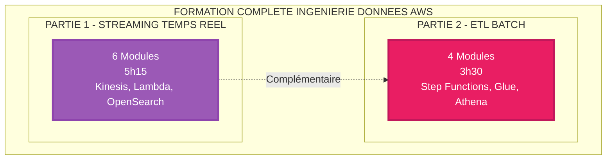
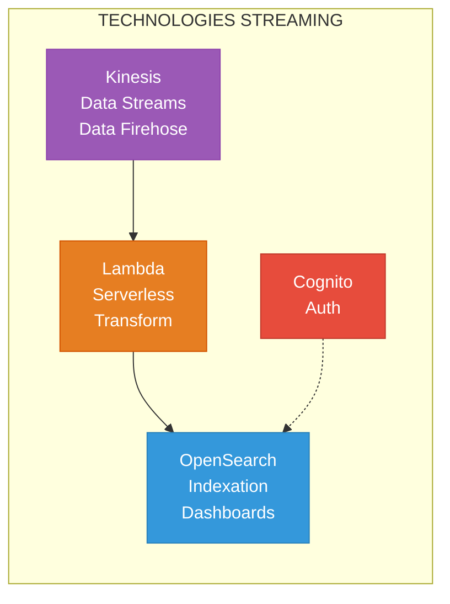
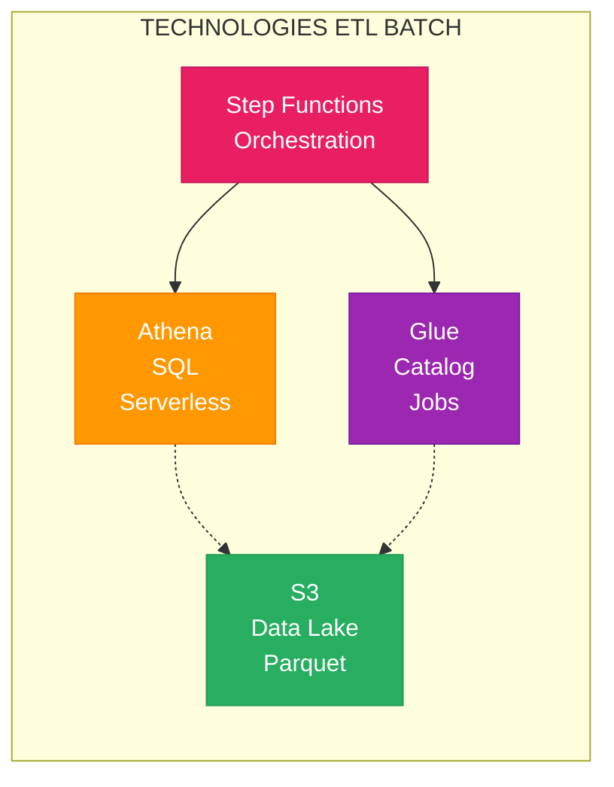

# FORMATION COMPLETE - PARTIES 1 & 2
## INGENIERIE DES DONNEES AWS

> Vue d'ensemble complète des deux formations complémentaires

---

# PRESENTATION GLOBALE

Formation professionnelle complète couvrant **streaming temps réel** ET **ETL batch** pour l'ingénierie des données sur AWS.



**Durée totale** : 8h45 de cours + 6h20 d'évaluations = **15 heures**

---

# COMPARAISON DETAILLEE

## Contenu

| Aspect | PARTIE 1 - Streaming | PARTIE 2 - ETL Batch |
|--------|---------------------|----------------------|
| **Modules cours** | 6 modules (5h15) | 4 modules (3h30) |
| **QCM** | 60 questions (80 min) | 40 questions (60 min) |
| **Questions dév** | 12 questions (280 min) | 4 questions (120 min) |
| **Diagrammes** | 13 Mermaid | 17 Mermaid |
| **Fichiers** | 18 fichiers | 13 fichiers |
| **Niveau** | Fondamental à Avancé | Fondamental à Avancé |

---

## Technologies Couvertes

### PARTIE 1 - Streaming Temps Réel



**Services** : Kinesis, Lambda, OpenSearch, Cognito, IAM, KMS, CloudWatch

**Cas d'usage** : Monitoring temps réel, détection fraude, alertes, IoT, logs streaming

---

### PARTIE 2 - ETL Batch



**Services** : Step Functions, Glue, Athena, S3, EventBridge

**Cas d'usage** : Rapports quotidiens, BI, Data Warehouse, ML training, archivage

---

## Compétences Développées

| Compétence | PARTIE 1 | PARTIE 2 | Niveau Final |
|------------|----------|----------|--------------|
| **Architecture pipelines** | Streaming | Batch | Expert |
| **Choix technologies** | Kinesis vs Kafka | Batch vs Streaming | Expert |
| **Transformation données** | Lambda temps réel | Athena SQL batch | Expert |
| **Optimisation** | OpenSearch indexation | Parquet/partitions | Expert |
| **Sécurité** | IAM, Cognito, KMS | IAM, encryption | Expert |
| **Monitoring** | CloudWatch streaming | CloudWatch batch | Expert |
| **Coûts** | Kinesis, Lambda | Athena, Step Functions | Expert |

---

# PARCOURS D'APPRENTISSAGE

## Parcours Complet (4 semaines)

**Semaine 1-2** : PARTIE 1 (Streaming)
- Modules 1-6
- QCM + Questions développement

**Semaine 3-4** : PARTIE 2 (ETL Batch)
- Modules 1-4
- QCM + Questions développement

**Total** : 4 semaines intensives

---

## Parcours Accéléré (2 semaines)

**Semaine 1** : Streaming (PARTIE 1)
- Jour 1-2 : Modules 1-3
- Jour 3-4 : Modules 4-6
- Jour 5 : QCM + révision

**Semaine 2** : ETL Batch (PARTIE 2)
- Jour 1-2 : Modules 1-3
- Jour 3 : Module 4 + QCM
- Jour 4-5 : Questions développement (PARTIE 1 + 2)

---

## Parcours Spécialisé

**SPECIALISATION STREAMING** :
- PARTIE 1 complète
- PARTIE 2 MODULE 01 uniquement (comprendre différence)

**SPECIALISATION ANALYTICS** :
- PARTIE 2 complète
- PARTIE 1 MODULES 01, 04 (contexte)

**ARCHITECTE DATA** :
- PARTIE 1 + PARTIE 2 complètes
- Focus sur questions développement (architectures)

---

# CERTIFICATION AWS

## Préparation AWS Certified Data Analytics - Specialty

### Couverture par Domaine

| Domaine | PARTIE 1 | PARTIE 2 | Couverture |
|---------|----------|----------|------------|
| **1. Collection** | Kinesis (complet) | S3 ingestion | 90% |
| **2. Storage** | S3, OpenSearch | S3, Glue Catalog, Parquet | 85% |
| **3. Processing** | Lambda | Step Functions, Glue Jobs, Athena | 80% |
| **4. Analysis** | OpenSearch Dashboards | Athena SQL, vues | 75% |
| **5. Visualization** | Dashboards | Athena + QuickSight | 60% |
| **6. Security** | IAM, Cognito, KMS | IAM, encryption | 85% |

**Compléments nécessaires** :
- Amazon EMR (Hadoop/Spark managé)
- Amazon QuickSight (BI dashboards)
- AWS Lake Formation (data lake governance)
- Amazon Redshift (data warehouse)

---

# PROJETS PRATIQUES SUGGERES

## Projet 1 - Architecture Hybride

**Combinez PARTIE 1 + PARTIE 2** :

```
Données temps réel → Kinesis → Lambda → OpenSearch (dashboards live)
                                      ↓
                                     S3 (archivage)
                                      ↓
                   Step Functions → Athena (rapports quotidiens)
```

**Durée estimée** : 2-3 jours  
**Compétences** : Streaming + Batch

---

## Projet 2 - E-commerce Analytics

**Streaming** :
- Clics temps réel → Kinesis → Lambda → Personnalisation

**Batch** :
- Données quotidiennes → Step Functions → Parquet → Rapports ventes

**Durée estimée** : 3-4 jours

---

## Projet 3 - Pipeline IoT Complet

**Streaming** :
- Capteurs IoT → Kinesis → Lambda → Alertes temps réel

**Batch** :
- Archivage S3 → Step Functions → Glue → Athena → ML training

**Durée estimée** : 4-5 jours

---

# EVALUATION GLOBALE

## Notation Complète (PARTIE 1 + PARTIE 2)

| Composante | PARTIE 1 | PARTIE 2 | TOTAL |
|------------|----------|----------|-------|
| **QCM** | 60 pts | 40 pts | 100 pts |
| **Questions Dév** | 120 pts | 40 pts | 160 pts |
| **Participation** | 20 pts | 10 pts | 30 pts |
| **TOTAL** | 200 pts | 90 pts | **290 pts** |

**Note finale** : /20

**Seuil réussite globale** : 12/20

---

# RESSOURCES GLOBALES

## Documentation

- AWS Well-Architected Framework
- AWS Big Data Blog
- AWS Architecture Center

## Livres

- "Streaming Systems" by Tyler Akidau (PARTIE 1)
- "Designing Data-Intensive Applications" by Martin Kleppmann (PARTIE 1 + 2)
- "The Data Warehouse Toolkit" by Ralph Kimball (PARTIE 2)

## Communauté

- AWS re:Post
- Reddit r/aws, r/dataengineering
- Stack Overflow

---

# NEXT STEPS

## Après Formation Complète

**Niveau Intermédiaire** :
- Pratiquer avec AWS Free Tier
- Créer projets personnels
- Contribuer open-source

**Niveau Avancé** :
- AWS Certified Data Analytics - Specialty
- AWS Certified Solutions Architect - Professional
- Approfondir Spark, Kafka, Airflow

**Spécialisations** :
- Machine Learning (SageMaker)
- Real-time ML (Kinesis + SageMaker)
- Data Governance (Lake Formation)
- Cost Optimization

---

# RESUME EXECUTIF

## Ce que vous maîtriserez

**Architecture** :
- Concevoir pipelines streaming ET batch
- Choisir technologies selon cas d'usage
- Optimiser performances et coûts

**Implémentation** :
- Kinesis pour streaming
- Step Functions pour orchestration
- Lambda pour transformations
- OpenSearch pour indexation temps réel
- Athena pour analytics SQL
- Formats optimisés (Parquet)

**Opérationnel** :
- Sécuriser architectures (IAM, KMS)
- Monitorer avec CloudWatch
- Estimer et optimiser coûts
- Dimensionner systèmes

---


