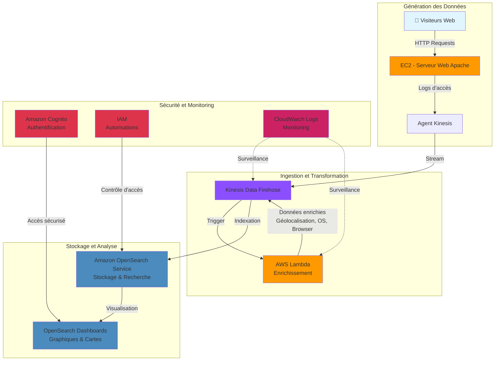
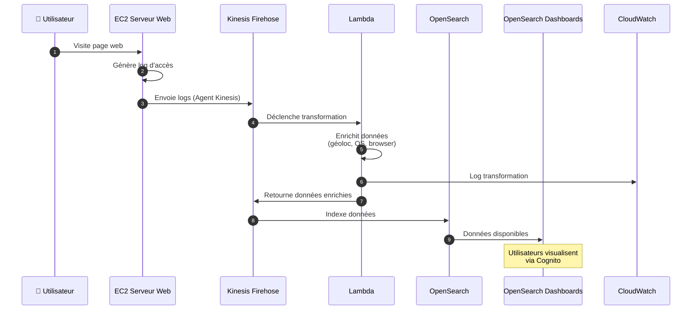

# *Introduction - Services AWS utilisés dans ce laboratoire*

Dans ce laboratoire, nous allons explorer une architecture complète permettant de **collecter, transformer, stocker et visualiser des données en streaming** grâce à plusieurs services clés d'AWS.

L'objectif est de simuler une situation réelle où un site web génère en continu des **journaux d'accès (logs)**, que nous allons analyser **quasi en temps réel** pour en tirer des informations utiles sur le comportement des visiteurs.

## 📊 Architecture Globale du Laboratoire

 

# 1 - **Amazon EC2 (Elastic Compute Cloud)**

> Service d’hébergement de machines virtuelles dans le cloud.

Dans ce laboratoire, nous utilisons EC2 pour **héberger un serveur web Apache** qui génère des fichiers journaux (logs) chaque fois qu’un utilisateur visite une page du site.

 

# 2 - **Amazon Kinesis Data Firehose**

> Service entièrement géré permettant de **collecter, transformer et charger des données en streaming** vers d’autres services.

Nous utilisons **Kinesis Data Firehose** pour :
- **Collecter les logs** du serveur web (via un agent installé sur l’instance EC2),
- Les transmettre automatiquement à une **fonction AWS Lambda** pour enrichissement,
- Puis les envoyer vers **OpenSearch Service** pour stockage et analyse.

 

# 3 - **AWS Lambda**

> Service de **calcul serverless** qui exécute du code en réponse à des événements, sans gérer de serveurs.

Dans ce laboratoire, Lambda est déclenché par Kinesis Firehose et :
- **Analyse chaque log en temps réel**,
- Enrichit les données avec des informations utiles (comme la **géolocalisation à partir de l’IP**, ou le type de navigateur et système d’exploitation),
- Renvoie les données enrichies vers Firehose.

 

# 4 - **Amazon OpenSearch Service**

> Fork d’Elasticsearch hébergé par AWS pour le **stockage, la recherche et l’analyse de données**.

Les données enrichies sont **indexées dans OpenSearch**, ce qui permet de :
- Effectuer des recherches très rapides dans les logs,
- Créer des agrégations de données (par navigateur, page visitée, géolocalisation, etc.).

 

# 5 - **OpenSearch Dashboards**

> Interface web pour **visualiser les données** stockées dans OpenSearch à l’aide de graphiques interactifs.

C’est ici que vous apprendrez à :
- Créer un **camembert** (pie chart) pour visualiser la répartition des visiteurs par navigateur et OS,
- Créer une **carte thermique** (heat map) pour identifier les pages qui génèrent le plus de trafic selon leur source (page de recherche vs page de recommandations).

 

# 6 - **Amazon Cognito** (pour l’authentification)

> Service de gestion des identités et des utilisateurs.

Dans ce laboratoire, Cognito permet aux utilisateurs métier de se connecter de façon sécurisée aux **Dashboards OpenSearch**, sans gérer manuellement des comptes IAM.

 

#  7 - **Amazon CloudWatch Logs**

> Service de collecte et d’observation des **logs applicatifs et système**.

Il nous permet de **suivre les événements en temps réel** :
- Voir les logs envoyés par EC2,
- Observer le traitement effectué par Lambda,
- Suivre les performances (durée, mémoire utilisée, etc.).

 

# 8 - En résumé :

| Service | Rôle |
|--------|------|
| **EC2** | Génére les logs à partir du site web |
| **Kinesis Firehose** | Transporte les données en streaming |
| **Lambda** | Enrichit les données automatiquement |
| **OpenSearch** | Stocke et indexe les logs |
| **Dashboards** | Crée des visualisations interactives |
| **Cognito** | Authentifie les utilisateurs métier |
| **CloudWatch Logs** | Surveille le traitement des données |

## 🔄 Flux de Données Simplifié

