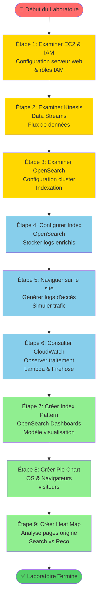
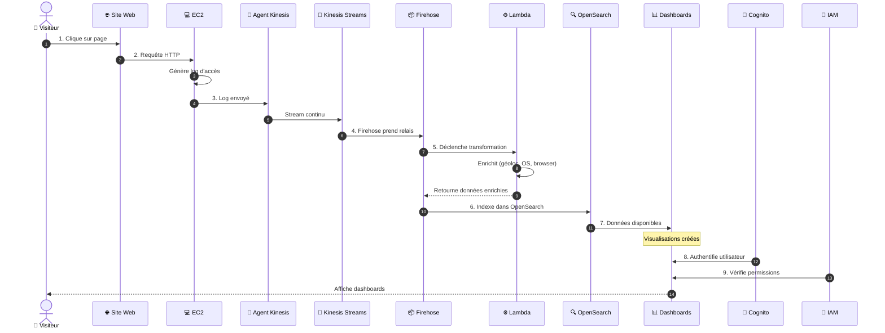

# 1 - *Explication des étapes du schéma (Numérotées 1 à 9)*

## 📋 Diagramme des 9 Étapes du Laboratoire

| # | **Étape** | **Description en français** |
|---|-----------|------------------------------|
| 1 | EC2 & IAM | Vous allez examiner la configuration de l’instance EC2 qui héberge le serveur web. Vous allez aussi analyser le rôle IAM `OsDemoWebserverIAMRole` et les politiques associées pour comprendre les autorisations accordées. |
| 2 | Kinesis Data Streams | Vous étudierez le flux de données Kinesis qui capture les journaux d’accès web en temps réel générés par les utilisateurs du site. |
| 3 | OpenSearch Service | Vous examinerez la configuration du cluster OpenSearch utilisé pour indexer et stocker les données. |
| 4 | Index OpenSearch | Vous configurerez un **index OpenSearch** pour stocker les journaux d’accès enrichis. Cet index permettra les recherches et les visualisations. |
| 5 | Navigation sur le site | Une fois la configuration terminée, vous naviguerez sur le site pour **générer des journaux d’accès**. Ces journaux simulent le trafic utilisateur. |
| 6 | Logs dans CloudWatch | Vous consulterez les **logs générés dans Amazon CloudWatch**, afin de comprendre comment Kinesis Firehose transmet les données à Lambda pour les enrichir avant l’indexation. |
| 7 | Pattern d’index | Vous créerez un **modèle d’index (index pattern)** dans OpenSearch Dashboards. Ce pattern est nécessaire pour pouvoir visualiser les données dans des graphiques. |
| 8 | Diagramme circulaire | Vous construirez une **visualisation en diagramme circulaire (pie chart)** pour montrer les systèmes d’exploitation et navigateurs utilisés par les visiteurs. |
| 9 | Carte thermique | Enfin, vous terminerez le laboratoire en créant une **carte thermique (heat map)** pour analyser les pages d’origine des visiteurs (page de recherche ou de recommandations). |

# 2 - **Vulgarisation du workflow de l’image**

Imagine que des gens visitent un **site web** (comme une boutique en ligne). Voici ce qui se passe en coulisses, étape par étape :

 

### 🧍‍♂️ 2.1. **Un utilisateur visite le site web**  
➡️ Chaque fois qu’un visiteur clique sur une page, cela génère un **journal d’activité** (log).  
Ce journal contient des infos comme :
- la page consultée,
- l’heure,
- l’adresse IP,
- le navigateur utilisé,
- etc.

 

### 💻 2.2. **Le serveur (Amazon EC2) enregistre le log**  
➡️ Le serveur web tourne dans **Amazon EC2**, un ordinateur virtuel dans le cloud.  
Chaque action d’un visiteur y génère un **fichier de log**.

 

### 📤 2.3. **Les logs sont envoyés à Kinesis (Data Streams)**  
➡️ Ces fichiers sont envoyés **en continu** dans un tuyau spécial appelé **Kinesis Data Streams**.  
C’est un peu comme un **tapis roulant rapide** qui transporte les données dès qu’elles sont créées.

 

### 📦 2.4. **Firehose prend le relais**  
➡️ Les données du tapis roulant sont transférées à **Kinesis Data Firehose**, qui agit comme un **livreur intelligent** :
- Il peut **enrichir** les données (par exemple : déterminer la ville du visiteur à partir de son IP),
- Et les **livrer automatiquement** à un endroit où on peut les analyser.

 

### ⚙️ 2.5. **Une fonction Lambda transforme les données**  
➡️ Avant de stocker les logs, Firehose déclenche une **fonction AWS Lambda** (un petit programme automatique).  
Cette fonction ajoute des **informations utiles** : géolocalisation, système d’exploitation, type d’appareil, etc.

 

### 📊 2.6. **Les données enrichies vont dans OpenSearch**  
➡️ Une fois prêtes, les données sont envoyées dans **Amazon OpenSearch Service**, un moteur de recherche qui permet :
- de **rechercher** dans les logs,
- de **trier**, **filtrer**, **compter**,
- et surtout : de **visualiser les résultats**.

 

### 👁️ 2.7. **On affiche les données dans OpenSearch Dashboards**  
➡️ Grâce à **OpenSearch Dashboards**, on peut créer :
- des **diagrammes circulaires** pour voir quels navigateurs sont les plus utilisés,
- des **cartes thermiques** pour savoir d’où viennent les visiteurs.

 

### 🔐 2.8. **Amazon Cognito gère l’accès**  
➡️ Pour que seuls les **bons utilisateurs** aient accès aux tableaux de bord, on utilise **Amazon Cognito**, qui gère l’authentification (identifiants, sécurité).

 

### 👮 2.9. **IAM contrôle les permissions**  
➡️ Enfin, **IAM (Identity and Access Management)** définit les **droits d’accès** :
- qui peut lire les données,
- qui peut modifier,
- qui peut accéder au Dashboard, etc.

 

# Résumé ultra simplifié

> 1. 👨‍💻 Un visiteur clique →  
> 2. 📄 EC2 enregistre →  
> 3. 📡 Les logs partent dans Kinesis →  
> 4. 📦 Firehose les prend →  
> 5. ⚙️ Lambda enrichit →  
> 6. 🔍 OpenSearch stocke →  
> 7. 📊 Dashboards affiche →  
> 8. 🔐 Cognito protège →  
> 9. 👮 IAM contrôle les accès.

## 🔄 Workflow Détaillé en Diagramme de Séquence

