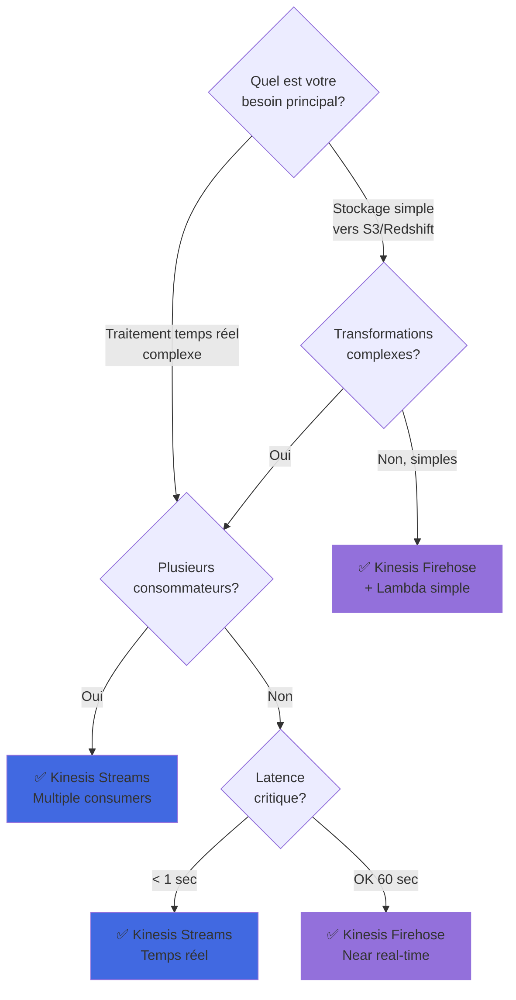
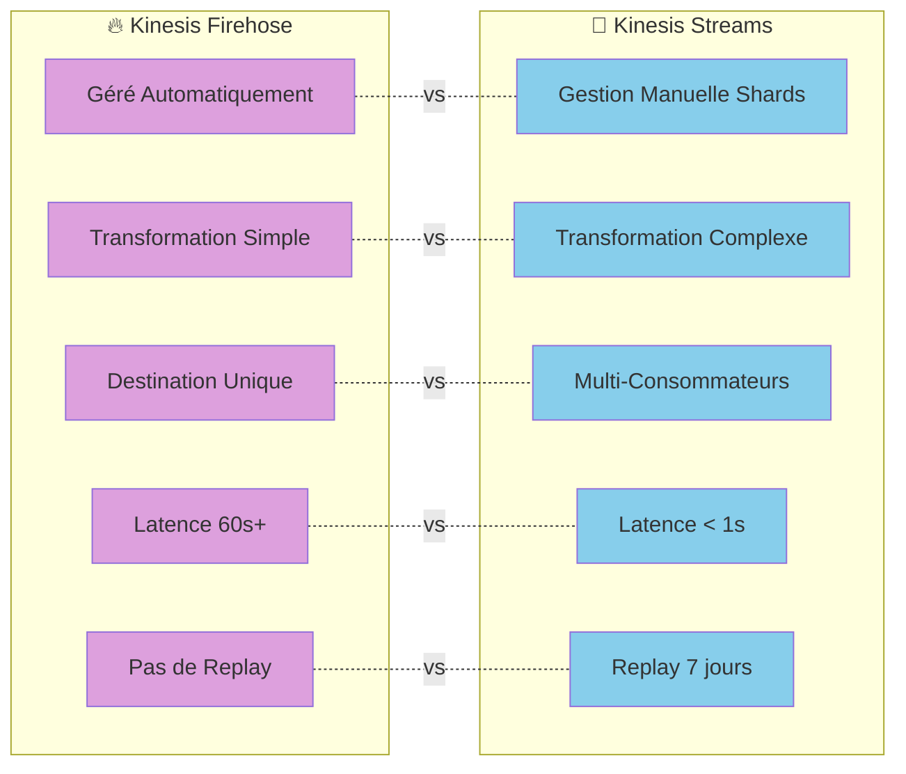

# Comparaison entre Amazon Kinesis Firehose et Kinesis Streams (Firestream) : Guide d'Utilisation et Cas Pratiques

# 1 - Question à laquelle le document répond 

*❓ Quelle est la différence entre Kinesis Firehose et Kinesis Streams (Firestream) dans des cas d'utilisation spécifiques ?*

## 🔀 Diagramme de Décision : Firehose vs Streams

## 📊 Comparaison Visuelle des Caractéristiques

# 2 - Tableau 1 : Comparaison générale des deux services

| **Cas d'Utilisation**                           | **Kinesis Firehose**                                       | **Kinesis Streams (Firestream)**                             |
|--------------------------------------------------|------------------------------------------------------------|-------------------------------------------------------------|
| **Gestion des flux de données sans maintenance** | - Automatisation complète de la gestion des flux. - Idéal si tu ne veux pas gérer manuellement les shards ou l'infrastructure de streaming. - Intégration simple avec S3, Redshift, etc. | - Gestion manuelle des shards et de la capacité. - À privilégier si tu souhaites un contrôle précis sur la partition et la gestion des flux. |
| **Transformation des données avant stockage**    | - **Avec Lambda** : Transforme les données en temps réel avant de les envoyer vers une destination comme S3. - Idéal pour des transformations simples, sans infrastructure à gérer. | - Peut intégrer Lambda avec un contrôle plus fin pour des transformations complexes en amont. |
| **Petites charges de données**                   | - Optimisé pour petites et moyennes charges avec son mécanisme de bufferisation. - Regroupe les petites charges pour une livraison efficace. | - Nécessite une gestion manuelle du nombre de shards selon la charge de données. Peut être surdimensionné pour de petites charges. |
| **Grandes charges de données**                   | - Scalabilité automatique pour de grandes charges. - Firehose distribue les données sans configuration manuelle de la capacité. | - Efficace pour des charges massives avec un contrôle total sur la gestion des partitions et des shards. - Configuration manuelle nécessaire pour ajuster le débit. |
| **Analyse en temps réel**                        | - Convient pour des pipelines simples où l'analyse en temps réel n'est pas critique. - Adapté pour la collecte et le stockage de données en temps quasi réel. | - Offre un contrôle total pour des analyses complexes en temps réel. - Idéal pour des cas nécessitant une faible latence. |
| **Enrichissement des données en transit**        | - **Avec Lambda** : Enrichit ou formate les données en transit avant de les stocker. - Simple à configurer sans gestion de l'infrastructure. | - Offre une flexibilité accrue pour enrichir les données avant qu'elles ne soient consommées. |
| **Faible latence**                               | - Supporte des flux quasi temps réel, mais pas optimal pour les cas où une latence minimale est critique. | - Conçu pour une faible latence avec un traitement quasi instantané des données. |
| **Cas d'utilisation avec besoin de persistance** | - Envoie les données vers des destinations de stockage persistantes comme S3 ou Redshift. - Idéal pour des pipelines où les données doivent être persistées régulièrement. | - Garde les données dans les shards pour une durée limitée (24h à 7 jours). - Idéal pour relire ou rejouer des flux de données. |

# 3 - Tableau 2 : Quand utiliser Firehose ou Streams selon le scénario

| **Cas d'Utilisation / Scénario**                         | **Kinesis Firehose**                                                                                           | **Kinesis Streams (Firestream)**                                                                                  |
|----------------------------------------------------------|------------------------------------------------------------------------------------------------------------|------------------------------------------------------------------------------------------------------------------|
| **Collecte de logs d'applications**                      | - **Scénario** : Collecte de logs d'une application web à grande échelle. - **Étude de cas** : Firehose bufferise les logs et les envoie vers S3 toutes les 60 secondes. - **Pourquoi Firehose ?** : Simplifie la gestion des flux sans intervention manuelle. | - **Scénario** : Suivi des logs en temps réel pour identifier des anomalies. - **Pourquoi Streams ?** : Meilleure flexibilité pour une gestion fine des logs et faible latence. |
| **Transformation des données avant stockage**         | - **Scénario** : Transformation des fichiers CSV en JSON avant stockage dans Redshift. - **Pourquoi Firehose ?** : Configuration simple avec Lambda pour transformer les données en temps réel. | - **Scénario** : Enrichissement des données avec des informations externes avant traitement. - **Pourquoi Streams ?** : Offre une transformation granulaire avant que les données ne soient envoyées à des consommateurs multiples. |
| **Streaming de données IoT**                             | - **Scénario** : Collecte de données de capteurs IoT pour stockage dans un data lake. - **Pourquoi Firehose ?** : Automatisation complète de l'envoi des données vers S3. | - **Scénario** : Réaction immédiate aux événements IoT en temps réel. - **Pourquoi Streams ?** : Nécessite une faible latence pour traiter et réagir aux données IoT. |
| **Analyse en temps réel des données financières**        | - **Scénario** : Archivage des transactions financières pour des audits futurs. - **Pourquoi Firehose ?** : Optimisé pour le stockage à des fins d'audit. | - **Scénario** : Détection des fraudes en temps réel. - **Pourquoi Streams ?** : Faible latence nécessaire pour une détection immédiate des fraudes. |
| **Traitement de flux vidéo en direct**                   | - **Scénario** : Archivage de flux vidéo depuis des caméras de sécurité pour analyse future. - **Pourquoi Firehose ?** : Automatisation de l'archivage des vidéos. | - **Scénario** : Analyse des flux vidéo en temps réel pour détecter des objets. - **Pourquoi Streams ?** : Latence ultra-faible pour une analyse en direct. |
| **Cas nécessitant de multiples consommateurs**             | - **Scénario** : Traitement des données pour une seule destination (ex. : S3). - **Pourquoi Firehose ?** : Optimisé pour envoyer les données vers une destination unique. | - **Scénario** : Plusieurs applications doivent lire et consommer les mêmes données. - **Pourquoi Streams ?** : Idéal pour traiter les données avec plusieurs consommateurs en parallèle. |

# 4 - Tableau 3 : Choix final en fonction des besoins

| **Scénario**                                            | **Kinesis Firehose**                               | **Kinesis Streams (Firestream)**                             |
|---------------------------------------------------------|----------------------------------------------------|-------------------------------------------------------------|
| **Besoin de gestion simplifiée et sans maintenance**     | - Utilise Firehose pour un service entièrement géré, sans gestion manuelle des shards. - Idéal pour les cas simples de collecte et de stockage de données (S3, Redshift). | - N’utilise pas Streams si tu ne veux pas gérer les shards et la capacité manuellement. |
| **Intégration de multiples services et applications**    | - N’utilise pas Firehose pour des flux nécessitant plusieurs intégrations complexes. | - Utilise Streams pour un contrôle total et l’intégration de multiples services en parallèle. |
| **Faible latence pour des décisions en temps réel**      | - N’utilise pas Firehose si tu as besoin d’une réponse immédiate. | - Utilise Streams pour des décisions immédiates en temps réel avec une faible latence. |
| **Relecture ou simulation des flux de données**          | - N’utilise pas Firehose pour rejouer des données déjà envoyées. | - Utilise Streams pour relire ou rejouer des flux de données sur 24h à 7 jours. |

# 5 - Annexe 1 - C’est quoi un shard ?

Un **shard** est une unité de capacité dans **Kinesis Streams**. Il permet de partitionner les flux de données pour mieux les gérer et les distribuer.

- **Capacité d’ingestion** : Un shard peut traiter jusqu’à **1 Mo par seconde** ou environ **1000 enregistrements par seconde**.
- **Capacité de lecture** : Chaque shard peut délivrer jusqu’à **2 Mo par seconde**.

Les **shards** permettent de **scaler** les flux de données en fonction des besoins, en ajoutant ou supprimant des shards selon le volume à traiter.

# 6 - Annexe 2 - Contrôle granulaire

Le **contrôle granulaire** dans **Kinesis Streams** signifie que tu peux gérer chaque aspect du flux de données avec une précision accrue, contrairement à **Firehose**, qui est plus automatisé.

Exemple :
- **Kinesis Streams** : Offre la possibilité de gérer les **shards**, de partitionner les données avec précision, et de configurer plusieurs consommateurs en parallèle.
- **Kinesis Firehose** : Moins flexible, mais plus simple, il automatise la gestion des flux sans besoin de configuration détaillée.

En résumé, choisis **Firehose** pour une solution simple et entièrement gérée, ou **Streams** pour un contrôle détaillé et granulaire sur la gestion des flux de données.

😊 **Astuce** : Utilise Firehose pour des pipelines de stockage simples et Streams pour des cas d’utilisation en temps réel avec plusieurs intégrations et un contrôle précis !
