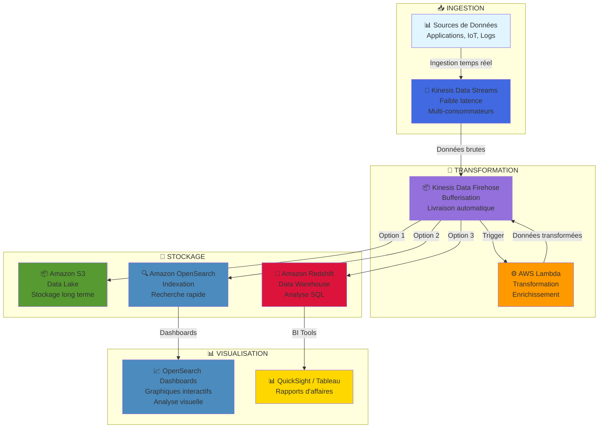

# Guide de Fonctionnement d'un Pipeline de Données en Streaming avec AWS  : Pipeline de Données en Streaming AWS : Kinesis Data Streams, Firehose, Lambda, et OpenSearch

## Question à laquelle ce document répond :

**Comment fonctionne une architecture de pipeline de données en streaming utilisant Amazon Kinesis Data Streams, Kinesis Data Firehose, Lambda et OpenSearch Service ?**

## 1. Architecture du pipeline de données

Cette architecture montre un **pipeline de données en streaming** qui utilise plusieurs services AWS pour **analyser** et **stocker des données** en temps réel. Décomposons cette architecture en plusieurs éléments clés pour bien comprendre leur fonctionnement.

## 🏗️ Architecture Complète du Pipeline

## 2. Où se trouve le stockage ?

Le **stockage** n'est pas montré directement sur le schéma, mais il existe deux emplacements implicites :

1. **Amazon OpenSearch Service** : Ce service permet d’indexer et de **stocker les données**, les rendant disponibles pour des **requêtes** et des **visualisations** via **OpenSearch Dashboards**.  
2. **Amazon Kinesis Data Firehose** : Bien que Firehose ne soit pas un stockage persistant, il est utilisé pour **livrer des données** vers des solutions de stockage externes comme **Amazon S3**, **Amazon Redshift**, ou d'autres outils analytiques.

**Exemple** : Firehose envoie souvent des données à un **bucket S3** pour un stockage à long terme.

## 3. Pourquoi utiliser Kinesis Data Streams et Firehose ensemble ?

### Kinesis Data Streams  
C’est un service conçu pour le traitement **en temps réel** des flux de données. **Kinesis Data Streams** assure l’ingestion fiable de gros volumes de données à **faible latence**, ce qui permet de traiter des données en temps réel. Il s'agit de l'entrée principale des données dans ce pipeline.

### Kinesis Data Firehose  
**Firehose** est utilisé pour **charger les données** dans un service cible, tel qu’**OpenSearch Service** ou un bucket **S3**. Firehose est un service entièrement géré qui **regroupe, compresse** et **livre** les données en streaming. Il simplifie l’envoi de données vers des solutions de stockage ou des outils analytiques.

## 4. Pourquoi Kinesis Data Streams avant Firehose ?

### Kinesis Data Streams vient en premier parce que :

1. **Traitement en temps réel** : **Kinesis Data Streams** est parfait pour ingérer et traiter les données en temps réel.  
2. **Personnalisation et flexibilité** : Il offre plus de contrôle sur les données. Par exemple, des **fonctions Lambda** peuvent être utilisées pour transformer les données au fil du flux.  
3. **Firehose n’est pas en temps réel** : **Kinesis Firehose** fonctionne en **mode proche du temps réel**, en tamponnant les données avant de les livrer. Il ne permet pas autant de contrôle sur les enregistrements individuels que Kinesis Streams.

## 5. Pourquoi utiliser Lambda ?

**AWS Lambda** joue un rôle important dans cette architecture pour :

1. **Traitement en temps réel** : Lambda peut transformer ou enrichir les données provenant de **Kinesis Data Streams** avant qu'elles ne soient livrées à **Firehose** ou à d'autres services.  
2. **Exécution serverless** : **Lambda** permet de traiter les données de manière automatisée, sans gestion de serveurs, en exécutant du code personnalisé basé sur les événements entrants.

## 6. Pourquoi ne pas utiliser uniquement Kinesis Streams ?

- **Kinesis Data Streams** seul est utilisé pour le traitement en temps réel, mais il ne gère pas aussi bien la **mise en tampon** ou la **livraison en lots** de données vers des destinations finales.  
- **Firehose** simplifie la livraison des données vers le **stockage** (comme **S3**) ou des services analytiques (comme **OpenSearch**) en gérant automatiquement les tampons et les erreurs.

**Exemple** : Utiliser **Kinesis Streams + Lambda** pour un traitement flexible en temps réel, tandis que **Firehose** assure une livraison efficace des données vers le stockage.

## 7. Conclusion simplifiée :

- **Kinesis Data Streams** pour l'ingestion en temps réel et une flexibilité accrue dans le traitement des données.  
- **Kinesis Data Firehose** pour la livraison des données de manière **simplifiée** et **fiable** vers des solutions de stockage.  
- **Lambda** pour un traitement **personnalisé** en temps réel.

Cette combinaison offre une **flexibilité**, une **scalabilité**, et une **efficacité** pour la gestion des données en streaming en temps réel et en **proche du temps réel**.
