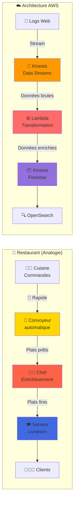
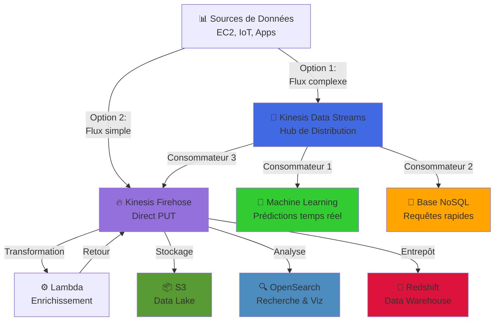

###  Streams et Firehose : pourquoi utiliser **les deux** ?
👉 Parce qu’ils **ne font pas la même chose**.

Tu peux les utiliser **ensemble OU séparément**, **selon le niveau de contrôle que tu veux** sur le flux de données.

<br/>

# 1 - Image mentale simple :  
Imagine un **restaurant** avec :

- un **convoyeur automatique** qui transporte les commandes (💨 rapide)  
- un **chef en cuisine** qui prépare les plats (enrichissement / transformation)  
- un **serveur** qui livre les plats dans la salle (destination finale)

<br/>

# 2 - Dans notre cas :

| Élément | Kinesis Data Streams | Kinesis Data Firehose |
|--------|----------------------|-----------------------|
| Métaphore | Le **convoyeur** de commandes rapide | Le **serveur** automatique qui livre les plats |
| Rôle | Transporte les données **brutes en temps réel** | Reçoit des données, les **transforme**, puis les **livre automatiquement** |
| Besoin d’un consommateur ? | ✅ Oui (Lambda, app perso) | ❌ Non (il livre directement dans OpenSearch, S3…) |
| Peut faire des analyses ? | ❌ Non (juste transmission) | ❌ Non (juste livraison, mais déclenche Lambda si besoin) |
| Peut enrichir les données ? | ✅ Si tu ajoutes une Lambda à la main | ✅ Automatiquement via configuration |
| Peut stocker ? | ❌ Non | ✅ Oui (OpenSearch, S3, Redshift, etc.) |

<br/>

# 3 - Pourquoi utiliser **les deux ensemble** ?

Dans les **cas avancés**, tu veux :

1. **Kinesis Data Streams** pour :
   - Capturer des données **en temps réel avec ultra faible latence**
   - Pouvoir les partager à **plusieurs consommateurs** (ex. : une Lambda + un moteur de ML + un stockage brut)

2. Ensuite, tu peux :
   - soit consommer ces données avec une **application personnalisée**,
   - soit les **rediriger vers Firehose** pour qu’il s’occupe de :
     - la **transformation** (via Lambda),
     - la **livraison finale** (OpenSearch, S3…).

💡 **Kinesis Data Streams = Hub de distribution rapide**  
💡 **Kinesis Firehose = Pipeline automatisé vers une destination**

<br/>

# 4 -  Exemple concret :

Imagine que tu construis un **système de suivi des transactions bancaires en temps réel**.

Tu pourrais :
- Utiliser **Kinesis Data Streams** pour que chaque transaction soit traitée par plusieurs services en même temps :
  - Un moteur de **détection de fraude**
  - Une **base NoSQL** pour requêtes rapides
  - Un **Firehose** pour stocker les logs dans S3

✅ **Streams** = te donne la **flexibilité**  
✅ **Firehose** = te donne la **simplicité**

<br/>

# 5 -  Résumé visuel ultra simple :

```
[EC2/Web logs] → [Kinesis Data Streams] → (multiples consommateurs)
                                       ↘→ [Kinesis Firehose] → [OpenSearch]

OU

[EC2/Web logs] → [Kinesis Firehose Direct PUT] → [OpenSearch]
```

## 🍽️ Analogie du Restaurant en Diagramme



## 🏗️ Architecture avec les Deux Services



