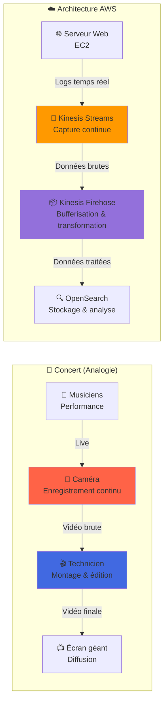
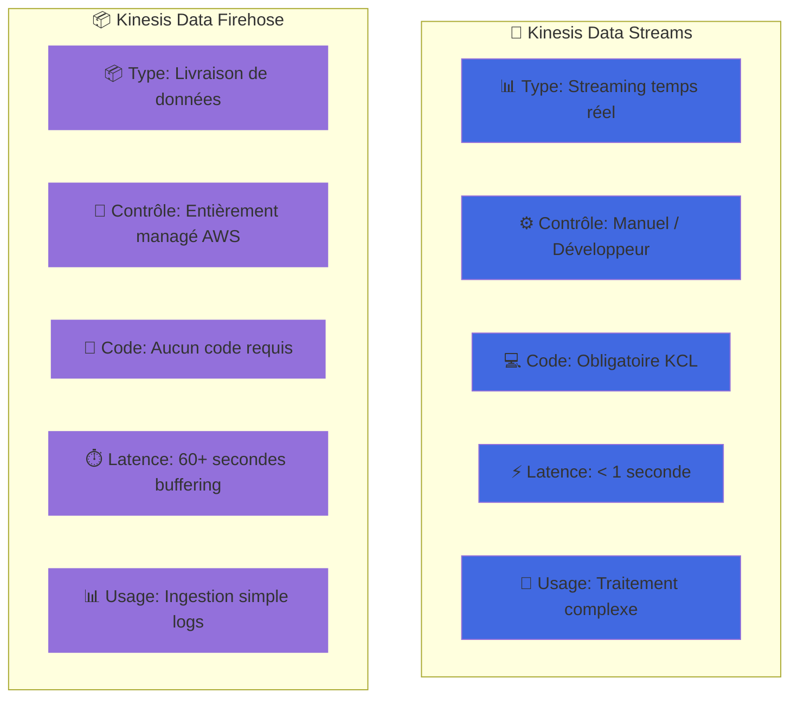

➡️ **Amazon Kinesis Data Streams**  
➡️ **Amazon Kinesis Data Firehose**

 
 

# 01 - Différence entre Kinesis Data Streams et Kinesis Data Firehose

| Caractéristique | **Kinesis Data Streams** | **Kinesis Data Firehose** |
|--------------------|--------------------------|----------------------------|
| **Type** | Service de **streaming en temps réel** | Service de **livraison de données** |
| **Contrôle** | Entièrement **géré par le développeur** | **Complètement managé** (AWS s’occupe de tout) |
| **Utilisation principale** | Traitement **avancé** de flux en temps réel avec une faible latence | **Ingestion automatique** et transformation **simple** avant stockage |
| **Nécessite du code client ?** | Oui, vous devez écrire du code pour consommer les données (ex : via KCL) | Non, vous **n’avez pas besoin de code**, tout est géré |
| **Transformation de données** | Vous devez connecter votre code ou Lambda manuellement | Intègre **AWS Lambda** directement pour enrichir les données |
| **Destination** | Vos applications personnalisées, Lambda, ou autre | **S3, Redshift, OpenSearch, Splunk...** |
| **Latence** | Très faible (en millisecondes) | Légèrement plus élevée (car livraison par batchs) |
| **Cas d’usage typique** | Traitement complexe de flux : fraudes, jeux, finance | Ingestion simple de logs, monitoring, analytique |

 
 

# 02 - Dans ton **schéma**, voici ce qui se passe exactement :

1. **EC2** (Serveur Web) génère des **logs d’accès**.
2. Ces logs sont envoyés à **Kinesis Data Streams** : ce service gère les événements en flux continu.
3. Ensuite, un **Firehose** prend ces données depuis Data Streams et :
   - (4) Les **stocke** dans **OpenSearch**,
   - (6) Envoie les logs à **CloudWatch**,
   - Et utilise **Lambda** pour les **enrichir** (géolocalisation, OS, navigateur, etc.).

> ⚠️ Dans ce labo, **Data Streams agit comme une source tampon**, et **Firehose comme un canal d’enrichissement + livraison**.

 
 

# 03 - Métaphore simple :

Imagine que tu filmes un concert :

- 🎥 **Kinesis Data Streams** = la **caméra** qui enregistre **chaque seconde** du concert en direct.
- 📦 **Kinesis Data Firehose** = le **technicien** qui **regroupe les séquences**, les **transforme si besoin**, puis les **transfère automatiquement** vers un écran géant (OpenSearch, S3…).

## 🎬 Métaphore du Concert en Diagramme

## 🔄 Tableau Comparatif Visuel

