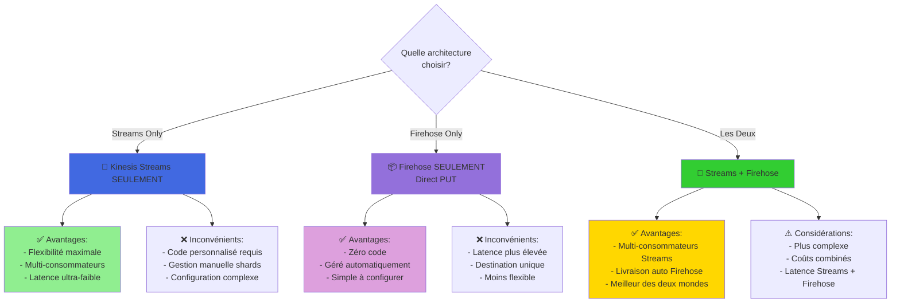
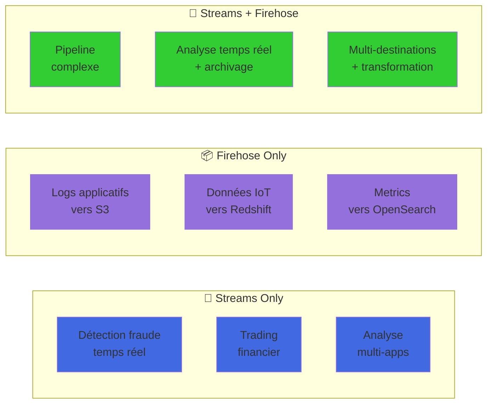

*Si j’utilise seulement l’un des deux (Kinesis Data Streams OU Firehose), est-ce que ça marcherait ? Et quelles seraient les conséquences ?*

 
 

# 01 - Cas 1 : **Tu utilises uniquement Kinesis Data Streams (et pas Firehose)**

Dans ce cas :

- Tu **reçois bien les logs** du serveur web dans le stream.
- **Mais rien ne se passe automatiquement** après.
- Tu dois **coder toi-même** un consommateur (ex : une application ou une Lambda connectée manuellement à ton stream).
- Il faut ensuite **écrire du code pour traiter, transformer et envoyer les données vers OpenSearch ou S3**.

### ✅ Avantage :
- Très **flexible** : tu peux faire des traitements ultra-personnalisés, filtrer, détecter des fraudes, faire du machine learning en direct, etc.

### ❌ Inconvénient :
- Beaucoup plus **complexe à gérer** (infrastructure, scale, gestion des erreurs...).
- **Pas automatisé** : tout repose sur ton code.

 
 

# 02 - Cas 2 : **Tu utilises uniquement Kinesis Data Firehose (sans Data Streams)**

Firehose **peut recevoir directement des données** (mode **Direct PUT**).  
Donc si tu installes **l’agent Kinesis** sur ton serveur EC2, tu peux envoyer tes logs **directement dans Firehose** (c’est ce que fait le labo).

### ✅ Avantage :
- **Aucune ligne de code nécessaire**.
- Firehose gère tout : collecte, buffering, transformation via Lambda, stockage dans OpenSearch.

### ❌ Inconvénient :
- Moins de contrôle sur les données **en temps réel** (latence plus haute).
- Pas adapté si tu veux faire du traitement avancé (détection d’anomalies, enrichissement complexe…).

 
 

# En résumé : Quand utiliser quoi ?

| Besoin | Utiliser **Kinesis Data Streams** | Utiliser **Kinesis Data Firehose** |
|--------|------------------------------|-------------------------------|
| Traitement avancé en temps réel | ✅ Oui | 🚫 Non |
| Pas de code, ingestion automatique | 🚫 Non | ✅ Oui |
| Contrôle fin sur le flux | ✅ Oui | 🚫 Non |
| Destination OpenSearch/S3 | ❌ Besoin de l'ajouter manuellement | ✅ Intégré |
| Enrichissement Lambda intégré | 🚫 Doit être branché à part | ✅ Inclus automatiquement |

## 🎯 Diagramme de Décision : Streams Only vs Firehose Only

## 📊 Cas d'Usage par Scénario

 
 

# 03- Et dans **notre labo** ?

Le schéma montre que **les logs passent par Data Streams AVANT Firehose**.

Mais en réalité, **dans le labo, c’est une simplification pédagogique** :
- L’**agent Kinesis installé sur EC2** envoie les logs **directement dans Firehose** (mode **Direct PUT**).
- Le flux Data Streams est **dessiné pour montrer que Firehose PEUT recevoir ses données depuis un stream**, mais ici **ce n’est pas le chemin réellement utilisé** dans le labo.

💡 Tu peux donc faire **ce labo sans Data Streams** en utilisant **seulement Firehose** avec l’agent Linux.

