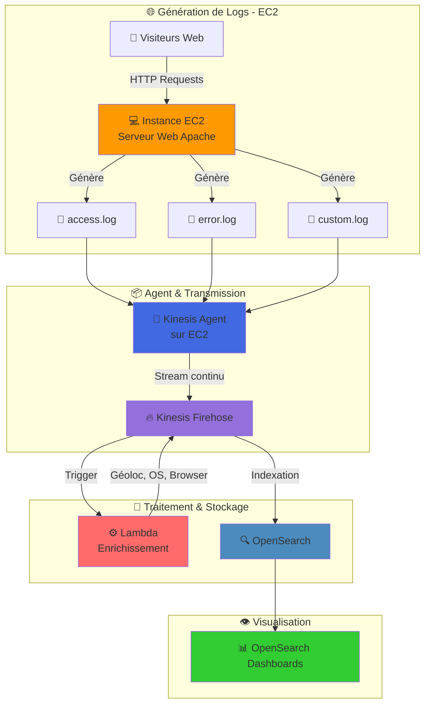

# Rôle du Serveur EC2 dans une Architecture AWS de Traitement des Logs  
Serveur EC2 et Analyse des Logs avec Kinesis et OpenSearch

## Question à laquelle le tutoriel répond :

**Quel est le rôle du serveur EC2 dans une architecture AWS de traitement et d’analyse des logs web, et pourquoi est-il nécessaire en combinaison avec Kinesis et OpenSearch ?**

## 1. Quel est le rôle du serveur EC2 ?  

Le **serveur EC2** dans cette architecture joue un rôle crucial dans la **génération des données** à analyser. C'est le **point de départ** des logs du serveur web, qui sont ingérés, traités et analysés par les services Kinesis et OpenSearch. Voici pourquoi un EC2 est utilisé dans ce contexte :

## 🖥️ Architecture EC2 dans le Pipeline de Logs

## 2. Rôle du serveur EC2  

### 1. Héberger le serveur web  
- Le serveur EC2 exécute un **serveur web** (comme Apache ou Nginx) qui génère des **logs d'accès** à chaque visite d'utilisateur sur le site web.  
- Les pages web visitées par les utilisateurs (comme `search.php`, `recommendation.php`, etc.) sont servies par ce serveur web, générant des logs contenant des informations telles que l'**utilisateur**, les **pages consultées**, les **navigateurs utilisés**, et les **dates/horaires d'accès**.

### 2. Générer des logs d'accès  
- Le but de ce laboratoire est d'analyser les **logs d'accès**. Chaque interaction des utilisateurs avec le site web génère ces logs, qui sont essentiels car ils contiennent des données sur le **comportement utilisateur** (navigateur, pages visitées, etc.). Ces logs seront ingérés et analysés via **Kinesis** et **OpenSearch**.

### 3. Point de départ du pipeline de traitement des données  
- Les logs générés par le serveur EC2 sont envoyés à **Kinesis Data Streams**, puis à **Kinesis Data Firehose** pour traitement, avant d’être livrés à **OpenSearch**.  
- Le serveur EC2 agit comme un **producteur de données**, initiant la chaîne de traitement.

### 4. Simulation d’un environnement de production  
- Dans un environnement réel, un site web nécessite un serveur pour fonctionner. Ici, **EC2** simule cet environnement, représentant un **serveur web d’entreprise** générant des données pour analyse. Cela permet de démontrer comment une solution AWS peut traiter des données en temps réel.

## 3. Pourquoi ne pas utiliser uniquement Kinesis sans EC2 ?  

Kinesis est un service AWS conçu pour collecter, traiter et livrer des **données en temps réel**, mais il nécessite **une source de données**. Le **serveur EC2** est cette source. Il héberge le site web qui génère les logs d’accès, et sans cette source de données, **Kinesis** n’aurait rien à ingérer ou à traiter.

## 4. En résumé  

- **EC2** est utilisé pour **héberger le serveur web** qui génère les **logs d’accès**.  
- Ces logs sont ensuite ingérés par **Kinesis** pour être traités en temps réel, avant d’être livrés à **OpenSearch** pour le stockage et l’analyse.  
- **EC2** simule un environnement de production, permettant de démontrer l’intégration et l’efficacité des capacités de **streaming** et d’**analyse** en temps réel d’AWS.

L'instance **EC2** est donc un élément clé dans ce laboratoire pour fournir les données nécessaires à la démonstration des capacités de **streaming** et d’analyse des logs web via AWS.
