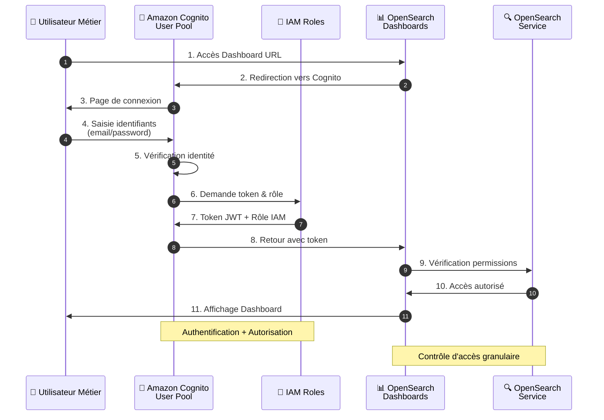
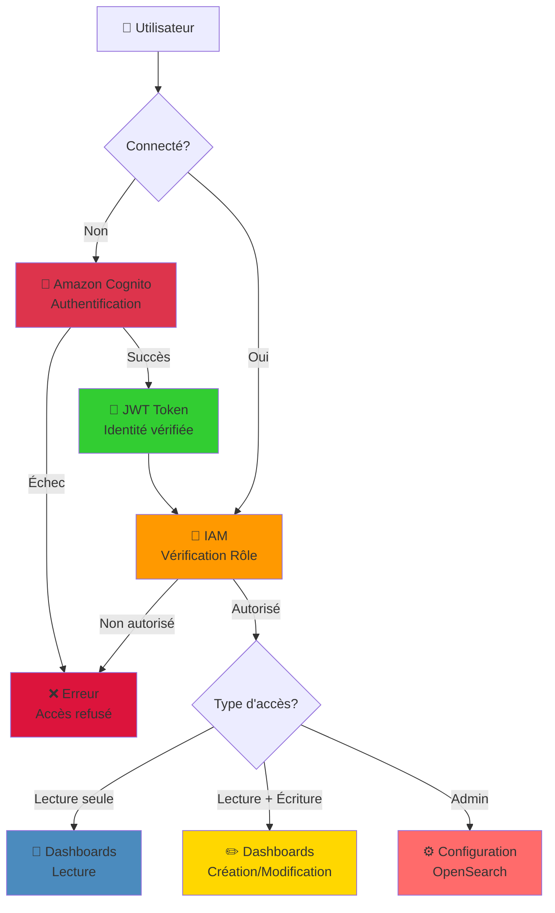

# Rôle et Utilisation d'Amazon Cognito pour Gérer l'Authentification avec OpenSearch  
Gestion de l'Authentification des Utilisateurs et Accès Sécurisé à OpenSearch

## Question à laquelle le tutoriel répond :

**Pourquoi et comment utiliser Amazon Cognito pour gérer l'authentification des utilisateurs dans une architecture AWS intégrant OpenSearch Dashboards ?**

## 1. Pourquoi utiliser Amazon Cognito dans cette architecture ?  

Dans cette architecture, **Amazon Cognito** est utilisé pour **gérer l'authentification des utilisateurs** qui accèdent aux **OpenSearch Dashboards**. Il joue un rôle clé dans la sécurisation des accès aux visualisations de données. Voici pourquoi Cognito est important :

## 🔐 Architecture de Sécurité avec Cognito

## 🛡️ Flux d'Authentification et Autorisation

## 2. Gestion de l'authentification  

- **Amazon Cognito** permet de **gérer l'accès** aux visualisations dans **OpenSearch Dashboards**. Les utilisateurs se connectent via Cognito pour accéder aux tableaux de bord, garantissant que seules les personnes autorisées peuvent visualiser les données.  
- Par exemple, dans ce laboratoire, les utilisateurs accèdent aux Dashboards via une interface de connexion Cognito où ils entrent leurs identifiants (comme "LabUser").  
- Cognito agit comme un **fournisseur d'identité**, vérifiant les utilisateurs avant qu'ils n'interagissent avec les visualisations.

## 3. Sécurisation des accès aux tableaux de bord  

- **OpenSearch Dashboards** est une plateforme où des **visualisations sensibles** peuvent être créées et consultées, telles que les logs d'accès et les comportements des utilisateurs.  
- **Cognito** s'assure que l'accès à ces visualisations est **sécurisé** en imposant une authentification obligatoire. Cela empêche tout accès non autorisé aux données analytiques stockées dans **OpenSearch**.

## 4. Intégration avec AWS Identity and Access Management (IAM)  

- **Cognito** s'intègre avec **AWS IAM** pour gérer les **autorisations** des utilisateurs après authentification. Non seulement Cognito authentifie, mais il peut aussi être utilisé pour contrôler ce que les utilisateurs peuvent ou ne peuvent pas faire.  
- Par exemple, dans cette architecture, IAM définit des politiques qui limitent certains utilisateurs à consulter uniquement certains tableaux de bord.

## 5. Authentification fédérée  

- **Cognito** prend en charge des **fournisseurs d'identité externes** tels que Google, Facebook, ou des systèmes d'entreprise via SAML. Les utilisateurs peuvent ainsi se connecter avec leurs identifiants existants tout en maintenant une gestion sécurisée des accès.

## 6. Expérience utilisateur simplifiée  

- **Cognito** propose une interface de connexion standardisée, simple à intégrer. Il permet une gestion fluide des **inscriptions, connexions** et **récupérations de mot de passe**, sans que l'administrateur ne doive gérer manuellement les identifiants. Cela simplifie l'expérience pour les utilisateurs comme pour les administrateurs.

## 7. Pourquoi pas une autre solution ?  

**Cognito** est souvent choisi dans un environnement AWS car il est **intégré nativement** avec d'autres services AWS comme OpenSearch, IAM, et Lambda. Il simplifie l'ajout de fonctionnalités de gestion d'identité et d'authentification sans avoir besoin de services externes ou de systèmes personnalisés.

## 8. En résumé  

- **Amazon Cognito** gère l'authentification des utilisateurs qui accèdent aux **OpenSearch Dashboards** pour s'assurer que seuls les utilisateurs autorisés peuvent consulter les données.  
- Il s'intègre avec **IAM** pour gérer les **permissions** après authentification.  
- Cognito simplifie la gestion des **connexions** et sécurise l'accès aux visualisations de données.

En bref, **Cognito** garantit que les bonnes personnes accèdent aux bons tableaux de bord dans un environnement sécurisé.

