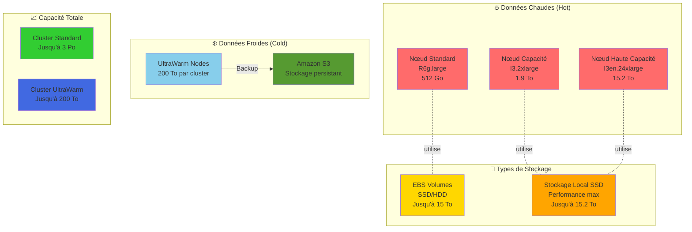

# Gestion du Stockage dans Amazon OpenSearch Service  
Limites et Stratégies pour un Cluster OpenSearch Optimal

## Question à laquelle le tutoriel répond :

*Quelles sont les limites de stockage dans Amazon OpenSearch Service et comment les gérer efficacement pour un cluster OpenSearch ?*

## 📊 Architecture de Stockage OpenSearch

## 1. Limites du stockage par instance  

Le stockage pour chaque nœud dans **Amazon OpenSearch Service** est déterminé par la taille du disque attaché à l'instance. Voici quelques exemples de **limites par instance** :

- **R6g.large.search** : Jusqu’à **512 Go** de stockage  
- **I3.2xlarge.search** : Jusqu’à **1,9 To** de stockage local par nœud  
- **UltraWarm** (données moins fréquemment accédées) : Jusqu'à **200 To par cluster** pour un coût réduit

## 2. Nombre de nœuds dans un cluster  

Le nombre de nœuds dans un **cluster OpenSearch** affecte la capacité de stockage totale. Chaque nœud a son propre volume de stockage, et en ajoutant des nœuds, vous augmentez la capacité du cluster.

## 3. Types de stockage  

- **EBS (Elastic Block Store)** : Les volumes EBS (SSD ou HDD) peuvent être attachés aux nœuds, offrant une grande capacité (plusieurs **To** par nœud selon le type d'instance)  
- **Stockage local** : Certaines instances, comme les **I3** et **I3en**, offrent un stockage SSD local performant, mais limité en taille (jusqu'à **15,2 To** pour les I3en.24xlarge)

## 4. UltraWarm pour les données froides  

Pour les données consultées moins fréquemment, **UltraWarm** permet de stocker des **pétabytes de données** à un coût inférieur en combinant **Amazon S3** et des nœuds de cache pour l'accès. Cela permet d'atteindre une capacité de **200 To par cluster**

## 5. Limite par index  

Bien qu'il n'y ait pas de limite stricte, il est recommandé de ne pas dépasser **50 Go** par shard pour de meilleures performances. **OpenSearch** utilise des shards pour répartir les données sur plusieurs nœuds. Si cette limite est dépassée, cela pourrait dégrader les performances.

## 6. Limites générales d'Amazon OpenSearch  

- Un cluster peut gérer jusqu'à **3 Po** de stockage pour les données fréquemment accédées (stockage chaud)  
- **Clusters UltraWarm** : jusqu'à **200 To** pour les données froides

## Conclusion  

La capacité de stockage d'Amazon OpenSearch Service dépend du type d'instances, du nombre de nœuds, et du stockage EBS ou local utilisé. En combinant **UltraWarm** et des volumes EBS, vous pouvez étendre le stockage à des **pétaoctets**. Cependant, il est essentiel de bien configurer les **shards** et de répartir les données pour garantir de bonnes performances.

En résumé, **Amazon OpenSearch** peut gérer des **pétaoctets de données** avec une bonne configuration et des stratégies de gestion de stockage adaptées, notamment en combinant le stockage **chaud et froid**.
