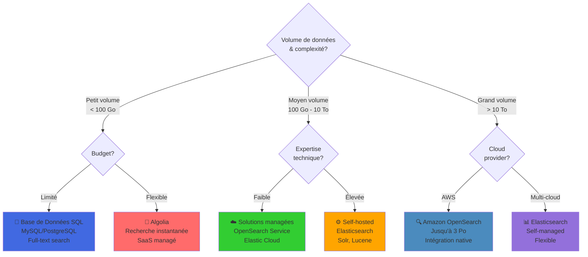
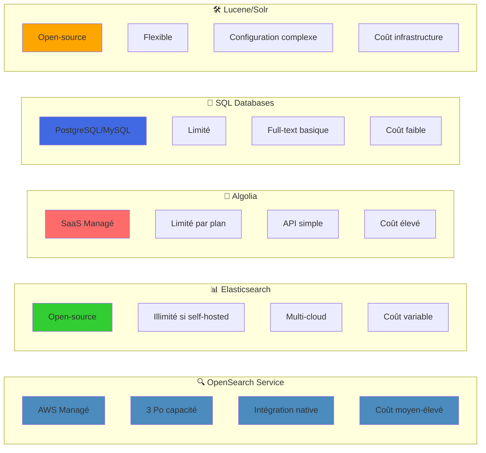

# Alternatives à Amazon OpenSearch Service : Options et Limites  

Comparaison des Solutions pour l'Indexation et la Recherche Web

# Question à laquelle le tutoriel répond :

*Quelles sont les alternatives à Amazon OpenSearch Service pour l'indexation et la recherche sur un site web, et quelles sont leurs limites ?*

## 1. Limites d'Amazon OpenSearch Service  

Lorsque vous **utilisez** OpenSearch, vous êtes limité par :

- La **capacité de stockage** par nœud et par cluster  
- Le nombre de **shards** et d'**index** que vous pouvez créer  
- La capacité à gérer des **requêtes complexes**, qui dépend des ressources (CPU, mémoire, etc.)  
- Le **coût** des **instances EC2** qui supportent le cluster  

Si vous **n'utilisez pas** OpenSearch, ces limites ne s'appliquent plus, mais vous devrez faire face à d'autres challenges selon la solution alternative choisie.

## 🔀 Arbre de Décision : Quelle Solution de Recherche?

## 📊 Comparaison des Alternatives

## 2. Alternatives à OpenSearch pour les sites web

### 1. Moteur de recherche interne (basé sur une base de données relationnelle)

- Utilisation d'une **base de données relationnelle** comme MySQL ou PostgreSQL pour exécuter des **requêtes SQL** pour la recherche  
- Limites :  
  - Moins performant pour des recherches complexes ou avec de grands volumes de données  
  - Difficile à **scaler** pour des recherches textuelles avancées (full-text search)  
- Compatibilité : Utilisé pour des **sites web de petite taille** ou avec des volumes de données modérés

### 2. Elasticsearch (alternative directe à OpenSearch)

- **Elasticsearch** est l'alternative la plus proche d'OpenSearch, bien adapté aux **recherches en temps réel** et aux analyses complexes  
- Limites :  
  - Nécessite de gérer et maintenir les clusters, sauf si vous utilisez un service managé comme **Elastic Cloud**  
  - Coût élevé à mesure que l'utilisation des ressources augmente  
- Compatibilité : Idéal pour des sites web nécessitant des **recherches complexes** et des **grands volumes de données**

### 3. Algolia

- **Algolia** est une solution de **recherche en tant que service**, avec des recherches ultra-rapides et des expériences personnalisées  
- Limites :  
  - Coût basé sur le nombre de recherches et la taille des données indexées  
  - Moins flexible pour des recherches complexes ou de grandes analyses par rapport à OpenSearch  
- Compatibilité : Adapté aux sites web nécessitant des **recherches instantanées** avec un **minimum de maintenance**

### 4. Moteurs de recherche personnalisés (Lucene, Solr, Sphinx)

- Vous pouvez utiliser des frameworks open-source comme **Apache Lucene** ou **Apache Solr** pour des **recherches textuelles** puissantes  
- Limites :  
  - Demande une **expertise technique** pour la mise en place et la gestion  
  - Pas d'intégration directe avec AWS comme OpenSearch  
- Compatibilité : Utilisé pour des sites web nécessitant des **recherches robustes** mais avec une gestion technique accrue

### 5. Base de données NoSQL avec fonctionnalités de recherche

- Des solutions comme **MongoDB** ou **Couchbase** offrent des fonctions de **full-text search** pour gérer des **données NoSQL**  
- Limites :  
  - Moins optimisées pour des recherches complexes par rapport à OpenSearch ou Elasticsearch  
  - Moins adaptées aux grands volumes de données pour des recherches analytiques  
- Compatibilité : Utilisé quand vous devez gérer à la fois des **données structurées et non structurées** avec des besoins de recherche modérés

## 3. Est-ce compatible pour un site web ?  

**Amazon OpenSearch Service** est tout à fait adapté aux **sites web** qui nécessitent :

1. **Moteur de recherche interne** : OpenSearch alimente les **barres de recherche** pour des recherches textuelles rapides (comme sur les sites de e-commerce)  
2. **Analyse de logs** : Les logs utilisateur peuvent être ingérés via **Kinesis** et analysés dans OpenSearch pour identifier des tendances  
3. **Tableaux de bord analytiques** : Avec **OpenSearch Dashboards**, vous pouvez visualiser des données comme les pages les plus visitées ou les erreurs récurrentes du site

## 4. Conclusion  

Si vous **n'utilisez pas OpenSearch**, vos limites dépendront de la solution alternative choisie. Si vous avez besoin d’un **moteur de recherche puissant** pour des **recherches complexes** et des **grands volumes de données**, OpenSearch ou Elasticsearch sont des choix judicieux. Cependant, pour des besoins plus simples, des bases de données relationnelles ou des services comme **Algolia** peuvent être plus adaptés et plus faciles à mettre en œuvre.
