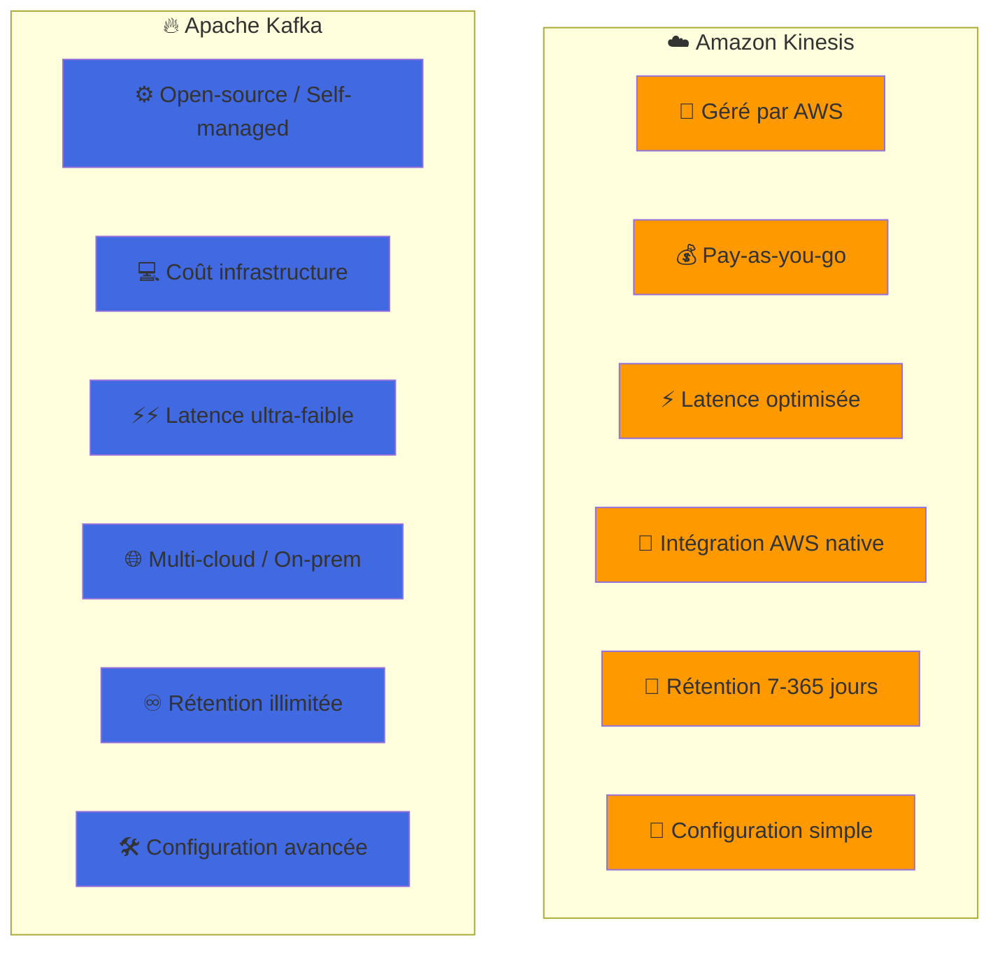
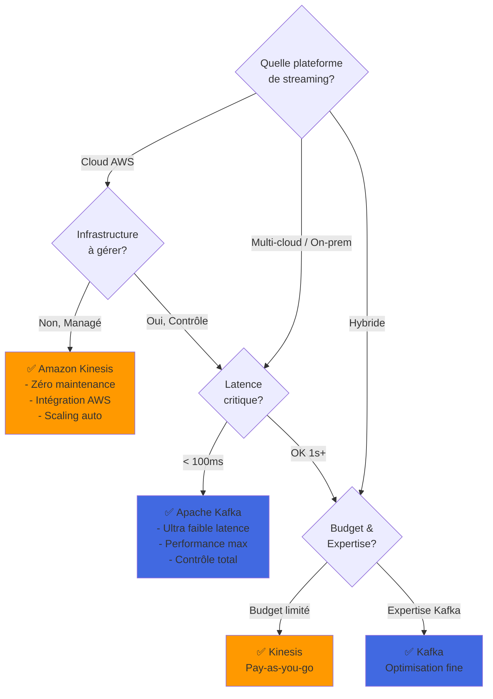

# Comparaison entre Amazon Kinesis et Apache Kafka pour le Streaming de Données  
## Quand Choisir Kinesis ou Kafka ?

## Question à laquelle le tutoriel répond :

**Quelle est la différence entre Amazon Kinesis et Apache Kafka pour la gestion des flux de données en temps réel, et quand choisir l'un plutôt que l'autre ?**

## 📊 Diagramme de Comparaison Visuelle

## 🎯 Diagramme de Décision : Kinesis vs Kafka

## 1. Table comparative entre Amazon Kinesis et Apache Kafka

| **Critère**                      | **Amazon Kinesis**                          | **Apache Kafka**                              |
|----------------------------------|---------------------------------------------|-----------------------------------------------|
| **Nature du service**            | Service **managé** (AWS s'occupe de la gestion) | **Open-source**, autogéré ou via services managés (Confluent, MSK) |
| **Facilité de gestion**          | Très simple, tout est géré par AWS (pas d'infrastructure à gérer) | Doit être installé, configuré et maintenu, sauf avec une solution managée (Confluent, MSK) |
| **Type de gestion des données**  | Données en **temps réel** | Données en **temps réel** avec stockage durable basé sur des logs distribués |
| **Scalabilité automatique**      | Scalabilité automatique via **Kinesis Shards** | Scalabilité manuelle avec ajout de partitions (ou automatique avec des services managés) |
| **Coût**                         | **Paiement à l'utilisation** selon le volume de données | **Gratuit** si autogéré, mais coûteux en infrastructure et en services managés |
| **Latence**                      | Optimisée pour les **grandes quantités de données**, latence plus élevée pour les petits volumes | Latence très faible, particulièrement efficace pour les grandes charges |
| **Intégration avec AWS**         | **Intégration native** avec Lambda, Firehose, S3, OpenSearch, etc. | Nécessite des **connecteurs** pour AWS, configuration supplémentaire requise |
| **Durée de rétention des données** | **7 jours** par défaut, extensible jusqu'à **365 jours** | **Rétention configurable**, potentiellement **illimitée** |
| **Gestion des erreurs**          | Tolérance aux pannes et **replay** automatique des données gérés par AWS | Kafka est robuste, mais la gestion des erreurs nécessite une configuration manuelle |
| **Streaming par lot (batching)** | Regroupement (batching) possible avec **Firehose**, mais conçu pour les flux en **temps réel** | Kafka excelle à la fois dans le **batching** et le traitement en temps réel |
| **Sécurité**                     | Sécurité gérée par AWS avec **IAM** et chiffrement par défaut | Sécurité configurable mais nécessitant TLS, SSL, Kerberos, etc. |
| **Options de traitement**        | Intégration avec **AWS Lambda** pour traitement en temps réel | Utilisation avec **Kafka Streams**, **KSQL**, ou des frameworks comme **Flink** |
| **Cas d'utilisation**            | Idéal pour une gestion **simple, en temps réel** avec intégration AWS | Environnements **autonomes**, multi-cloud, ou besoins de charges massives et complexes |

## 2. Différences clés

### Facilité de gestion  
**Kinesis** est entièrement **managé** par AWS, ce qui signifie que tu n’as pas besoin de gérer l’infrastructure. **Kafka**, de son côté, doit être installé, configuré et maintenu, sauf si tu utilises des services managés comme **Confluent** ou **Amazon MSK**.

### Intégration avec AWS  
Si ton architecture repose principalement sur **AWS**, Kinesis s'intègre **nativement** avec d'autres services comme **Lambda**, **S3**, et **OpenSearch**. Kafka, en revanche, nécessite des **connecteurs** et des configurations supplémentaires pour interagir avec les services AWS.

### Coût  
**Kinesis** fonctionne sur un modèle de **paiement à l'utilisation**, ce qui signifie que tu payes en fonction du volume de données ingérées et du nombre de **shards**. **Kafka** est open-source et **gratuit** si autogéré, mais cela implique des coûts d'infrastructure (serveurs, maintenance). Les services Kafka managés peuvent être plus coûteux en fonction du volume de données.

### Latence et performances  
**Kafka** offre généralement une latence **plus faible** et de meilleures performances avec des flux de données très volumineux, tandis que **Kinesis** est optimisé pour les grandes quantités de données, bien que sa latence puisse être plus élevée pour de petits volumes.

### Rétention des données  
**Kinesis** a une rétention par défaut de **7 jours**, extensible jusqu'à **365 jours**, tandis que **Kafka** offre une rétention **configurable** et potentiellement **illimitée** selon tes besoins.

## 3. Quand choisir Kinesis ?

- Tu utilises un **environnement AWS** et tu veux éviter de gérer l’infrastructure  
- Tu cherches une solution **simple et managée**, avec une intégration facile avec les services AWS comme Lambda, S3, et OpenSearch

## 4. Quand choisir Kafka ?

- Tu as besoin de **plus de contrôle** sur ton infrastructure de streaming de données  
- Tu travailles dans un environnement **multi-cloud** ou tu as des charges de données massives nécessitant une **latence très faible**  
- Tu es prêt à gérer toi-même l'infrastructure ou tu utilises un service Kafka managé comme **Confluent** ou **MSK**

## 5. Conclusion simplifiée

- **Kinesis** est une solution **managée** parfaite pour les architectures AWS avec des besoins en **streaming en temps réel** et une gestion simplifiée  
- **Kafka** est une solution **flexible** et **performante** pour des environnements complexes, autonomes ou multi-cloud, où la latence et la gestion des **flux massifs** de données sont des priorités
