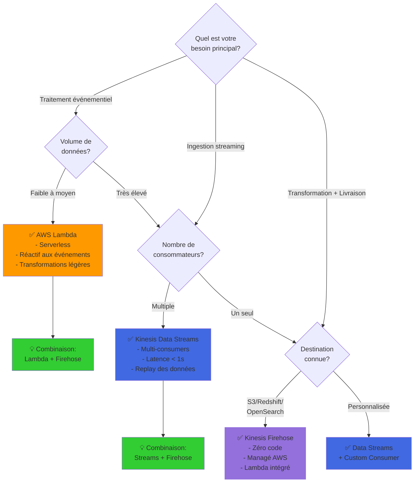
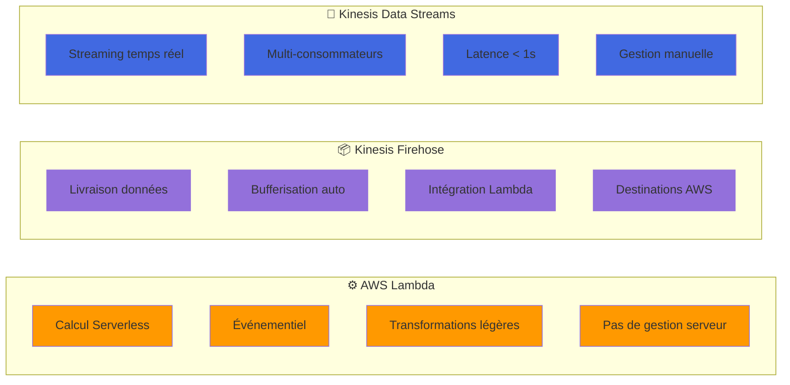

### Quand utiliser AWS Lambda, Kinesis Firehose ou Kinesis Data Streams

Dans la conception d'architectures de pipeline de données sur AWS, il est essentiel de choisir les services appropriés en fonction des besoins spécifiques de traitement, d'ingestion, de transformation et de livraison des données. Voici un aperçu des scénarios typiques où chaque service est le plus adapté :

## 🎯 Arbre de Décision : Lambda vs Firehose vs Data Streams

## 📊 Matrice de Comparaison Visuelle

#### 1. AWS Lambda

**Description**  
AWS Lambda est un service de calcul sans serveur qui exécute du code en réponse à des événements et gère automatiquement les ressources de calcul requises.

**Quand l'utiliser**  
- Traitement événementiel : réagir à des événements spécifiques (modifications S3, mises à jour DynamoDB, messages SQS)  
- Transformations légères : filtrage, enrichissement, conversion de format des données en temps réel  
- Intégration de services : orchestration entre services AWS, déclenchement depuis Kinesis Firehose  
- Automatisation : tâches ponctuelles ou récurrentes, comme la génération de rapports

**Exemples d'utilisation**  
- Transformation des données avant stockage S3 via Firehose  
- Déclenchement de notifications ou d’alertes  
- Validation et nettoyage en temps réel

#### 2. Amazon Kinesis Data Firehose

**Description**  
Kinesis Firehose est un service entièrement géré pour capturer, transformer et charger des données de streaming vers des destinations telles qu’Amazon S3, Redshift, Elasticsearch, etc.

**Quand l'utiliser**  
- Livraison simplifiée : ingestion et livraison continue vers des destinations spécifiques  
- Transformations intégrées : transformations simples via Lambda intégré  
- Cas d'usage standardisés : exigences connues, scénarios bien définis  
- Scalabilité automatique : ajustement automatique du débit

**Exemples d'utilisation**  
- Ingestion de logs vers S3  
- Livraison de données de clics web vers Redshift  
- Données IoT vers OpenSearch Service

#### 3. Amazon Kinesis Data Streams

**Description**  
Kinesis Data Streams est un service hautement personnalisable pour collecter et traiter des données en temps réel avec une latence très faible.

**Quand l'utiliser**  
- Traitement personnalisé : analyses complexes, logique métier spécifique  
- Multiples consommateurs : plusieurs applications consommant simultanément un même flux  
- Contrôle granulaire : gestion du débit, partitionnement, traitement distribué  
- Traitement à grande échelle : analyse de gros volumes de données avec faible latence

**Exemples d'utilisation**  
- Détection de fraude en temps réel  
- Agrégation et transformation multi-sources  
- Traitement de données IoT complexes

### Résumé des Choix

| Critère / Service           | AWS Lambda                                    | Kinesis Firehose                                  | Kinesis Data Streams                               |
|-----------------------------|-----------------------------------------------|---------------------------------------------------|----------------------------------------------------|
| Complexité de traitement     | Transformations légères                      | Transformations simples via Lambda intégrée       | Transformations complexes et personnalisées        |
| Gestion de l'infrastructure | Aucune, serverless                           | Entièrement géré                                 | Gestion manuelle requise                           |
| Scénarios d'utilisation     | Traitement réactif, intégration              | Livraison vers destinations analytiques           | Applications en streaming temps réel, multi-apps   |
| Scalabilité                 | Automatique selon les événements             | Automatique                                      | Manuelle (via gestion des shards)                  |
| Coût                        | Basé sur exécutions                          | Basé sur volume ingéré                           | Basé sur les shards et le débit traité             |

### Conseils Pratiques

- Utiliser Lambda avec Firehose pour transformer les données avant livraison
- Combiner Data Streams avec Lambda ou EMR pour des cas de traitement avancé
- Choisir Firehose pour les flux simples vers S3, Redshift ou OpenSearch
- Utiliser Data Streams si plusieurs services consomment les mêmes données ou si un contrôle détaillé est requis

### Annexe : Table comparative détaillée

| Critère / Service            | AWS Lambda                                    | Kinesis Firehose                                  | Kinesis Data Streams                               |
|------------------------------|-----------------------------------------------|---------------------------------------------------|----------------------------------------------------|
| Type de service              | Calcul sans serveur                           | Livraison de données en streaming                 | Streaming en temps réel                            |
| Cas d'usage principal        | Réactions à événements                        | Ingestion et livraison continue                   | Traitement personnalisé de flux complexes          |
| Capacité de traitement       | Transformations légères                      | Ingestion continue + transformations basiques     | Traitement sur mesure via outils externes          |
| Transformation des données   | Nettoyage, enrichissement                     | Lambda intégré                                    | Traitement via Lambda, EMR, Kinesis Analytics      |
| Scalabilité                  | Automatique                                   | Automatique                                       | Manuelle (gestion des shards)                      |
| Multiples consommateurs      | Non                                           | Non                                               | Oui                                                |
| Destination des données      | Variable selon événement                     | S3, Redshift, Elasticsearch, Splunk               | À définir via consommateurs                        |
| Coût                         | Exécution et durée                            | Volume ingéré et transformé                       | Nombre de shards et volume                         |
| Gestion infrastructure       | Aucune                                        | Aucune                                            | Requiert gestion active                            |
| Latence                      | Très faible                                   | Faible                                            | Très faible                                        |
| Scénarios adaptés            | Traitement ponctuel léger, validation         | Streaming simplifié vers outils analytiques       | Analyse temps réel avancée, consommation multiple  |
| Complexité de mise en œuvre  | Faible                                        | Faible                                            | Élevée                                             |

### Résumé des usages spécifiques

- **AWS Lambda** : Pour le traitement léger, déclenché par des événements. Convient aux volumes modérés et scénarios réactifs.  
- **Kinesis Firehose** : Pour la livraison continue vers des destinations, avec transformation légère. Idéal pour minimiser la gestion.  
- **Kinesis Data Streams** : Pour des cas complexes, avec plusieurs consommateurs, et besoin d'un traitement avancé avec faible latence.

Cette présentation vous aide à choisir le bon service AWS selon vos objectifs de traitement, de contrôle et de simplicité de mise en œuvre dans vos pipelines de données.
