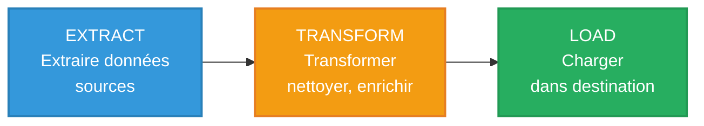
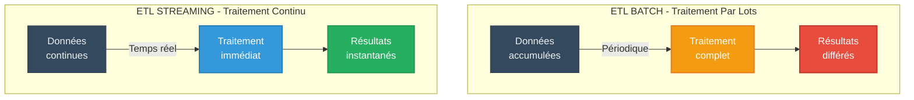
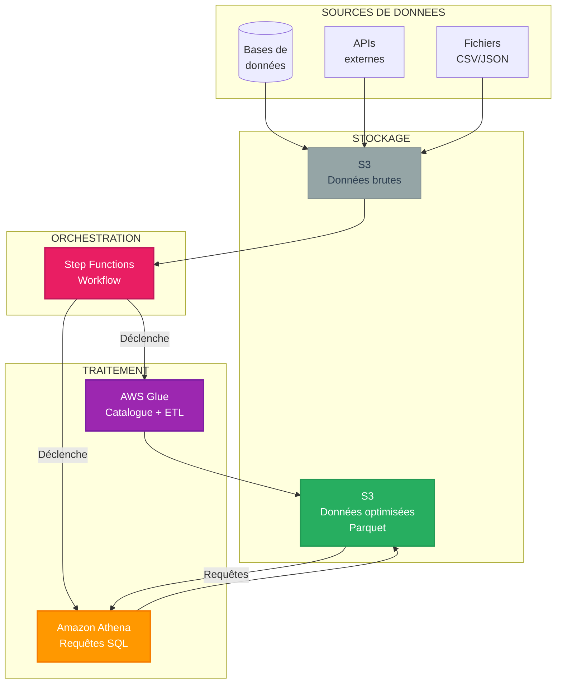
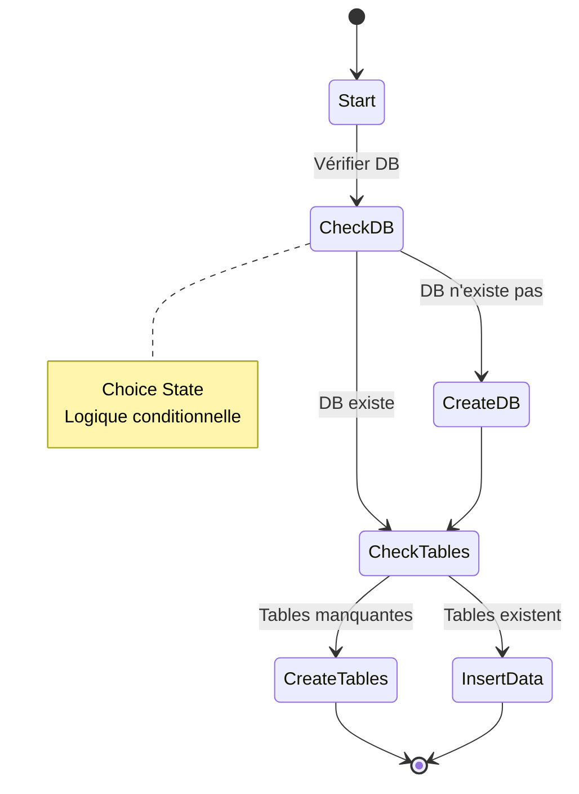
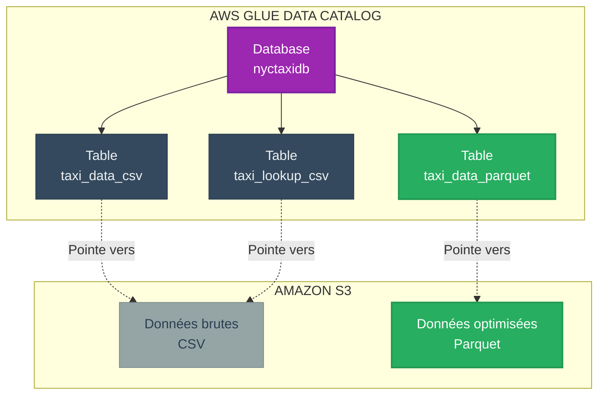
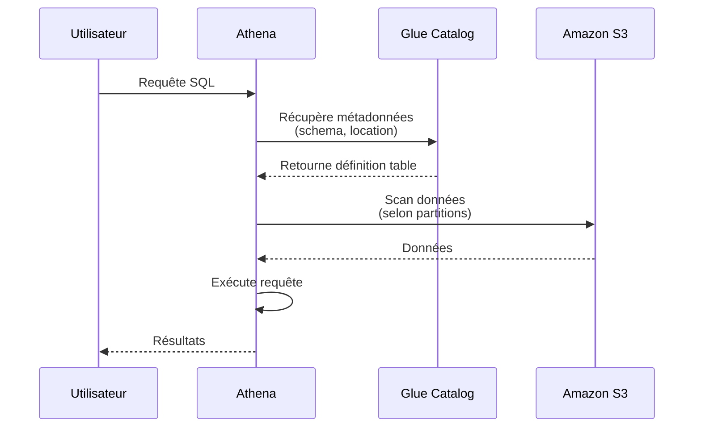
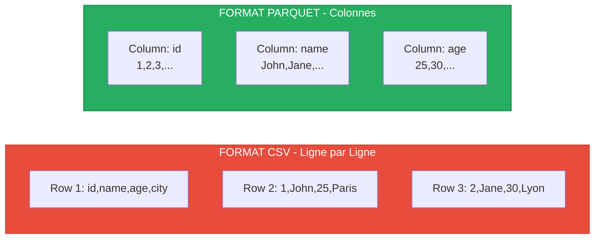
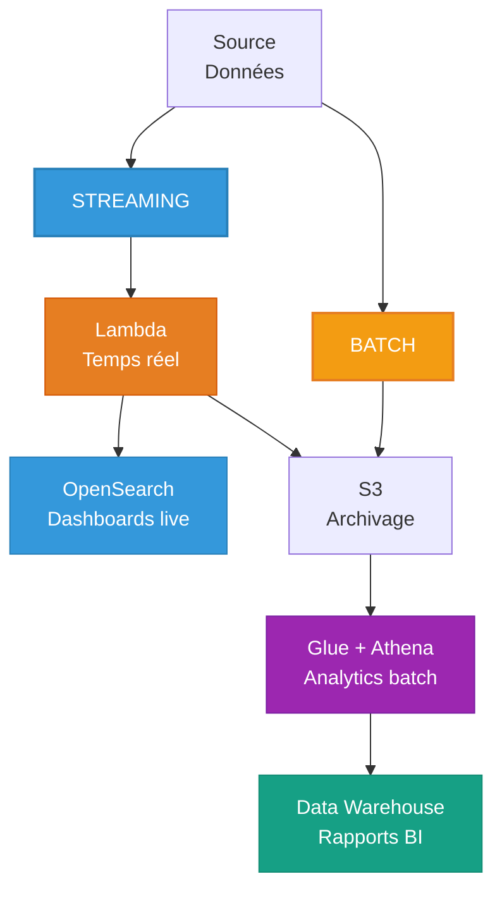
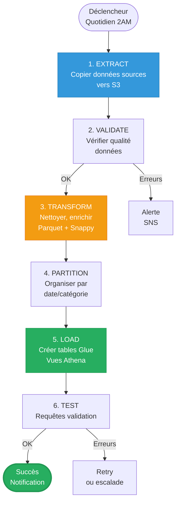
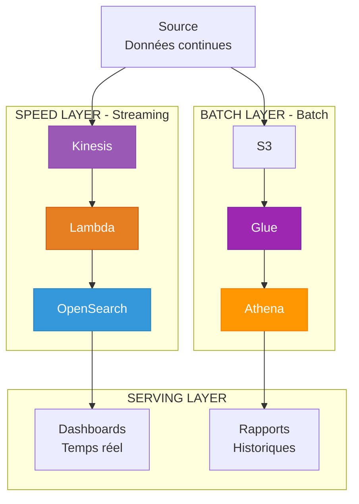

# MODULE 1 - ETL BATCH VS STREAMING

**Durée** : 45 minutes  
**Niveau** : Fondamental  
**Objectifs** : Comprendre les différences entre ETL batch et streaming, savoir choisir

---

# 1. CONCEPTS ETL

## 1.1 Définition ETL

**ETL** = Extract, Transform, Load



| Phase | Description | Exemples |
|-------|-------------|----------|
| **Extract** | Récupération données depuis sources | CSV, bases de données, APIs, logs |
| **Transform** | Nettoyage, enrichissement, agrégation | Parsing, jointures, calculs, filtrage |
| **Load** | Chargement dans système cible | Data warehouse, data lake, base analytics |

---

## 1.2 ETL Batch vs ETL Streaming



### Tableau Comparatif

| Critère | ETL BATCH | ETL STREAMING |
|---------|-----------|---------------|
| **Fréquence** | Périodique (horaire, quotidien) | Continu (temps réel) |
| **Latence** | Minutes à heures | < 1 seconde |
| **Volume traité** | Gros volumes par lot | Flux continu record par record |
| **Complexité** | Faible à moyenne | Moyenne à élevée |
| **Coût** | Prévisible (batch planifié) | Variable (basé sur flux) |
| **Technologies AWS** | Step Functions, Glue, Athena, EMR | Kinesis, Lambda, OpenSearch |
| **Format données** | Parquet, ORC, CSV (optimisé) | JSON, Avro (streaming) |
| **Cas d'usage** | Rapports quotidiens, BI, ML training | Monitoring, alertes, fraude temps réel |

---

# 2. ARCHITECTURE ETL BATCH

## 2.1 Architecture de Référence



---

## 2.2 Services AWS pour ETL Batch

| Service | Rôle | Caractéristiques |
|---------|------|------------------|
| **AWS Step Functions** | Orchestration workflows | State machines, logique conditionnelle, retry automatique |
| **AWS Glue** | Catalogue de données + ETL | Métadonnées, schémas, crawlers, jobs Spark |
| **Amazon Athena** | Requêtes SQL sur S3 | Serverless, SQL standard, sans infrastructure |
| **Amazon S3** | Stockage data lake | Scalable, peu coûteux, formats multiples |
| **AWS Glue DataBrew** | Préparation données visuelle | No-code data prep |

---

# 3. AWS STEP FUNCTIONS - VUE D'ENSEMBLE

## 3.1 Concept de State Machine

**State Machine** = Workflow défini par états et transitions



### Types d'États

| Type | Description | Usage |
|------|-------------|-------|
| **Task** | Exécute une action (invoke Lambda, requête Athena) | Traitement principal |
| **Choice** | Logique conditionnelle (if/else) | Routage workflow |
| **Parallel** | Exécution parallèle de branches | Traitement simultané |
| **Map** | Itération sur array | Traiter chaque élément |
| **Wait** | Pause temporelle | Attente délai |
| **Pass** | Passe données sans action | Debug, placeholder |
| **Succeed/Fail** | Termine avec succès/échec | Fin workflow |

---

## 3.2 Intégration Athena

Step Functions peut déclencher Athena de 2 façons :

**Synchrone (.sync)** :
- Step Functions attend la fin de la requête
- Retourne résultats
- Usage : Créer tables, vérifications

**Asynchrone** :
- Lance requête et continue
- Ne bloque pas le workflow
- Usage : Requêtes longues en background

---

# 4. AWS GLUE - CATALOGUE DE DONNEES

## 4.1 Architecture Glue



### Composants Glue

| Composant | Description | Utilité |
|-----------|-------------|---------|
| **Database** | Container logique de tables | Organisation |
| **Table** | Métadonnées (schema, location S3) | Définition structure |
| **Crawler** | Scan automatique S3 pour inférer schema | Discovery |
| **Job** | Script ETL Spark/Python | Transformation |
| **Catalog** | Registre central métadonnées | Partage entre services |

---

# 5. AMAZON ATHENA - REQUETES SQL

## 5.1 Fonctionnement

**Athena** = SQL sur S3 sans serveur



### Caractéristiques

- **Serverless** : Aucune infrastructure à gérer
- **SQL standard** : Syntaxe ANSI SQL
- **Pricing** : Basé sur données scannées (5 USD/TB)
- **Performance** : Parallélisation automatique
- **Formats** : CSV, JSON, Parquet, ORC, Avro

---

# 6. OPTIMISATION : FORMAT PARQUET

## 6.1 CSV vs Parquet



### Comparaison Technique

| Aspect | CSV | Parquet |
|--------|-----|---------|
| **Structure** | Ligne par ligne (row-based) | Colonnes (columnar) |
| **Compression** | Faible (gzip) | Excellente (Snappy, gzip) |
| **Taille** | 100% | **20-40%** du CSV |
| **Lecture colonne** | Scan fichier complet | Lecture colonnes nécessaires uniquement |
| **Performance SELECT** | Lente (scan tout) | **Très rapide** (colonnes ciblées) |
| **Cas d'usage** | Export simple, compatibilité | **Analytics, Big Data, Athena** |

### Gains Parquet

**Exemple réel** : Données taxis NYC

| Métrique | CSV | Parquet + Snappy | Gain |
|----------|-----|------------------|------|
| Taille stockage | 1 GB | 300 MB | **-70%** |
| Coût S3/mois | 0.023 USD | 0.007 USD | **-70%** |
| Scan Athena | 1 GB | 300 MB | **-70%** coût requête |
| Latence requête | 10 sec | 3 sec | **-70%** temps |

---

## 6.2 Compression Snappy

**Snappy** = Algorithme compression rapide

| Compression | Ratio | Vitesse Compression | Vitesse Décompression | Usage |
|-------------|-------|---------------------|----------------------|-------|
| **Snappy** | Moyen (2-3x) | **Très rapide** | **Très rapide** | **Parquet analytics** |
| **Gzip** | Élevé (3-5x) | Lente | Moyenne | Archivage long terme |
| **Zstd** | Élevé (3-4x) | Rapide | Rapide | Équilibre optimal |

> **Choix Snappy** : Compromis optimal vitesse/compression pour analytics interactives

---

## 6.3 Partitionnement

**Partitionnement** = Division données par valeurs de colonnes

```
s3://bucket/data/
├── pickup_year=2020/
│   ├── pickup_month=01/
│   │   └── data.parquet (Janvier 2020)
│   ├── pickup_month=02/
│   │   └── data.parquet (Février 2020)
│   └── pickup_month=12/
│       └── data.parquet (Décembre 2020)
└── pickup_year=2021/
    └── pickup_month=01/
        └── data.parquet (Janvier 2021)
```

**Avantages** :

| Bénéfice | Description | Gain |
|----------|-------------|------|
| **Partition pruning** | Scan uniquement partitions pertinentes | -90% données scannées |
| **Performance** | Requêtes ciblées ultra rapides | 10x plus rapide |
| **Coût** | Moins de données scannées | -90% coût Athena |
| **Parallélisation** | Traitement partitions en parallèle | Scalabilité |

**Exemple requête** :
```sql
SELECT * FROM taxi_data 
WHERE pickup_year = '2020' AND pickup_month = '01'
```
→ Scan uniquement `s3://bucket/data/pickup_year=2020/pickup_month=01/`

---

# 7. CAS D'USAGE : BATCH VS STREAMING

## 7.1 Quand Choisir ETL Batch

**Scénarios préférables** :

**Rapports quotidiens/mensuels** :
- Résultats ne sont pas urgents
- Traitement de gros volumes
- Historisation et tendances

**Data Warehouse / BI** :
- Alimenter Redshift, Snowflake
- Dashboards business non temps réel
- Analyses complexes (agrégations lourdes)

**ML Training** :
- Préparation datasets historiques
- Feature engineering batch
- Entraînement modèles offline

**Archivage et Conformité** :
- Conversion formats (CSV → Parquet)
- Compression et optimisation stockage
- Rétention long terme

---

## 7.2 Quand Choisir ETL Streaming

**Scénarios préférables** :

**Monitoring temps réel** :
- Dashboards live (< 1s)
- Alertes immédiates
- Métriques opérationnelles

**Détection anomalies** :
- Fraude bancaire
- Cyberattaques
- Défaillances IoT

**Personnalisation temps réel** :
- Recommandations live
- Contenu dynamique
- Tarification dynamique

---

## 7.3 Architecture Hybride

**Meilleure approche** : Combiner batch ET streaming



**Exemple e-commerce** :
- **Streaming** : Détection fraude transactions en temps réel
- **Batch** : Rapport ventes quotidien + analytics tendances

---

# 8. WORKFLOW ETL BATCH TYPIQUE

## 8.1 Étapes Standard



---

# 9. COMPARAISON ARCHITECTURES

## 9.1 Architecture Lambda (Streaming + Batch)



**Architecture Lambda** = Speed Layer (streaming) + Batch Layer (batch)

**Avantage** : Meilleur des 2 mondes  
**Inconvénient** : 2 pipelines à maintenir

---

# 10. POINTS CLES DU MODULE

- ETL Batch traite données par lots périodiquement (vs streaming continu)
- Step Functions orchestre workflows complexes avec logique conditionnelle
- Glue fournit catalogue métadonnées (tables, schemas)
- Athena permet requêtes SQL serverless sur S3
- Parquet + Snappy optimise stockage et performances (70% économie)
- Partitionnement réduit drastiquement données scannées (-90%)
- Choisir batch ou streaming selon latence requise et cas d'usage
- Architecture hybride combine avantages batch + streaming

---

# 11. EXERCICES DE REFLEXION

1. Votre entreprise génère 500 GB de logs/jour. Besoin de rapports quotidiens uniquement. Batch ou streaming ?

2. Calculez économies si données 10 TB CSV converties en Parquet (70% réduction) :
   - Stockage S3 : 0.023 USD/GB/mois
   - Requêtes Athena : 5 USD/TB scanné, 100 requêtes/mois

3. Concevez workflow Step Functions pour :
   - Vérifier si table existe
   - Si non : créer table
   - Si oui : insérer nouvelles données
   - Créer vue finale

4. Comparez latence bout-en-bout :
   - Pipeline batch : Données → S3 → Step Functions → Athena → Résultat
   - Pipeline streaming : Données → Kinesis → Lambda → OpenSearch → Résultat

5. Quelle stratégie de partitionnement pour logs applicatifs horodatés ?

