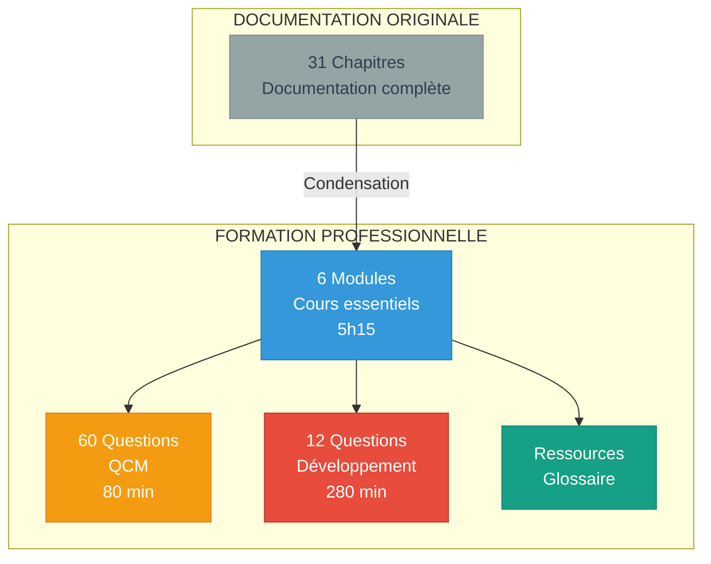

# RÉCAPITULATIF DE LA FORMATION
## INGENIERIE DES DONNEES - STREAMING AWS

> Vue d'ensemble complète de la formation professionnelle

---

# STRUCTURE COMPLETE

## Vue d'Ensemble

**31 chapitres originaux** condensés en **formation professionnelle minimaliste**



---

# CONTENU DÉTAILLÉ

## 01-COURS (6 Modules - 5h15)

| # | Module | Durée | Niveau | Diagrammes | Tableaux | Code |
|---|--------|-------|--------|------------|----------|------|
| **01** | Architecture Streaming AWS | 45 min | Fondamental | 4 Mermaid | 3 | 0 |
| **02** | Amazon Kinesis | 60 min | Intermédiaire | 3 Mermaid | 5 | 2 |
| **03** | Transformation Lambda | 45 min | Intermédiaire | 2 Mermaid | 4 | 3 Python |
| **04** | OpenSearch Indexation | 60 min | Intermédiaire+ | 1 Mermaid | 6 | 8 JSON/HTTP |
| **05** | Sécurité Encryption | 45 min | Intermédiaire | 2 Mermaid | 5 | 3 JSON |
| **06** | Comparaisons Technologiques | 60 min | Avancé | 1 Mermaid | 7 | 0 |

### Caractéristiques Techniques

**Format uniforme** :
- Pas d'emojis
- Pas de lignes `================`
- Titres markdown structurés (# 1., ## 1.1)
- Séparateurs propres `---`

**Éléments visuels** :
- **13 diagrammes Mermaid** colorés (fond sombre)
- **30 tableaux** markdown comparatifs
- **16 blocs de code** (JSON, Python, HTTP)

---

## 02-EVALUATIONS

### QCM (4 fichiers - 60 questions)

| Fichier | Questions | Durée | Points | Format |
|---------|-----------|-------|--------|--------|
| QCM-MODULE-01 | 10 | 20 min | 10 | Checkbox GitHub |
| QCM-MODULE-02 | 10 | 20 min | 10 | Checkbox GitHub |
| QCM-MODULES-03-06 | 40 | 40 min | 40 | Checkbox GitHub |
| CORRIGES-QCM | - | - | - | Tableaux réponses |

**Total** : 60 questions, 80 minutes, 60 points

### Questions de Développement (6 fichiers - 12 questions)

| Fichier | Questions | Points | Durée | Focus |
|---------|-----------|--------|-------|-------|
| DEV-MODULE-01 | 2 | 20 | 45 min | Architectures streaming |
| DEV-MODULE-02 | 2 | 20 | 45 min | Dimensionnement Kinesis |
| DEV-MODULE-03 | 2 | 20 | 45 min | Pipeline Lambda + optimisation |
| DEV-MODULE-04 | 2 | 20 | 50 min | Index OpenSearch + dashboards |
| DEV-MODULE-05 | 2 | 20 | 45 min | Sécurité IAM + Cognito |
| DEV-MODULE-06 | 2 | 20 | 50 min | Kinesis vs Kafka + hybrid |

**Total** : 12 questions, 280 minutes, 120 points

### Spécificités Questions Développement

**Chaque question demande OBLIGATOIREMENT** :

| Livrable | Description | Présent dans |
|----------|-------------|--------------|
| **Schémas architecture** | Diagrammes pipelines complets | Toutes questions |
| **Calculs dimensionnement** | Formules + résultats | Questions techniques |
| **Code/Config** | Pseudo-code ou JSON | Questions implémentation |
| **Tableaux comparatifs** | Analyses multicritères | Questions choix |
| **Estimations coûts** | USD/mois détaillés | Questions business |

---

## 03-RESSOURCES

| Fichier | Contenu | Entrées |
|---------|---------|---------|
| GLOSSAIRE-TECHNIQUE.md | Définitions alphabétiques | ~80 concepts |

---

# TYPES DE QUESTIONS DE DÉVELOPPEMENT

## Par Type de Livrable

### Questions Architecture (6 questions)

**Demandent explicitement** :
- Dessiner schéma architectural complet
- Annoter flux de données
- Identifier composants AWS
- Montrer points de transformation

**Exemple** : Question 1 Module 01
```
"1. Schéma architecture : Diagramme complet avec tous 
    les services AWS et flux de données (4 pts)"
```

### Questions Pipeline (4 questions)

**Demandent explicitement** :
- Diagramme de séquence du flux
- Pipeline détaillé étape par étape
- Points de transformation identifiés
- Latences annotées

**Exemple** : Question 2 Module 01
```
"1. Pipeline détaillé : Schéma du flux 
    EC2 → ... → Dashboards (4 pts)"
```

### Questions Dimensionnement (3 questions)

**Demandent explicitement** :
- Calculs de capacité (shards, instances)
- Formules utilisées
- Résultats intermédiaires
- Estimation finale

**Exemple** : Question 1 Module 02
```
"2. Calculs dimensionnement : Records/s, MB/s, 
    nombre de shards requis (3 pts)"
```

### Questions Configuration (4 questions)

**Demandent explicitement** :
- Code JSON (mappings, politiques IAM)
- Pseudo-code Python (Lambda)
- Configuration détaillée
- Gestion d'erreurs

**Exemple** : Question 1 Module 03
```
"3. Code Lambda : Pseudo-code Python complet 
    avec gestion erreurs (4 pts)"
```

### Questions Comparaison (3 questions)

**Demandent explicitement** :
- Matrices de décision
- Tableaux scoring multicritères
- Schémas de chaque option
- TCO (Total Cost of Ownership)

**Exemple** : Question 1 Module 06
```
"2. Matrice comparative : Tableau 4 options × 
    8 critères avec scoring /5 (3 pts)"
```

---

# EVALUATION GLOBALE

## Répartition des Points

| Composante | Questions | Points | Durée | Poids |
|------------|-----------|--------|-------|-------|
| **QCM** | 60 | 60 | 80 min | 30% |
| **Questions Développement** | 12 | 120 | 280 min | 60% |
| **Participation/Projet** | - | - | - | 10% |
| **TOTAL** | 72 | 180 | 360 min | 100% |

## Note Finale

**Formule** :
```
Note Finale = (QCM × 30% + Questions Dev × 60% + Participation × 10%) / 20
```

**Seuil réussite** : 12/20

---

# POINTS FORTS DE LA FORMATION

## Approche Pédagogique

**Progressive** :
1. MODULE 01 : Concepts de base
2. MODULE 02-03 : Services techniques
3. MODULE 04 : Stockage et analyse
4. MODULE 05 : Sécurité transversale
5. MODULE 06 : Vision stratégique

**Pratique** :
- 12 questions nécessitant dessiner architectures
- Calculs de dimensionnement réels
- Estimations de coûts réalistes
- Code et configurations concrètes

**Professionnelle** :
- Format GitHub-ready
- Diagrammes Mermaid
- Tableaux markdown
- Pas d'emojis
- Style épuré

## Compétences Développées

**Techniques** :
- Concevoir architectures streaming
- Dimensionner infrastructures
- Écrire configurations (JSON)
- Coder transformations (Python)

**Analytiques** :
- Comparer technologies
- Choisir solutions optimales
- Évaluer trade-offs
- Estimer coûts

**Communication** :
- Dessiner schémas clairs
- Justifier choix techniques
- Présenter analyses
- Documenter architectures

---

# UTILISATION RECOMMANDEE

## Pour Étudiants

### Semaine 1-2 : Apprentissage

- Étudier modules 1-3
- Faire QCM après chaque module
- Réviser concepts mal compris

### Semaine 3-4 : Approfondissement

- Étudier modules 4-6
- Faire tous les QCM
- Commencer questions développement

### Semaine 5-6 : Maîtrise

- Faire toutes questions développement
- Dessiner architectures
- Pratiquer calculs dimensionnement
- Révision générale

## Pour Formateurs

### Utilisation en Cours

**Cours magistral** : Projeter les modules avec diagrammes Mermaid  
**TD** : Utiliser questions développement comme exercices  
**Évaluation** : QCM (contrôle continu) + Questions dev (examen final)

### Adaptation

**Cours court (20h)** : Modules 1, 2, 4 + QCM  
**Cours complet (40h)** : Tous modules + toutes évaluations + projets  
**Spécialisation sécurité** : Modules 1, 5 + questions sécurité

---

# CHECKLIST UTILISATION

## Avant de Commencer

- [ ] Lire README.md
- [ ] Consulter 00-GUIDE-UTILISATION.md
- [ ] Parcourir structure dans 00-INDEX-FORMATION.md
- [ ] Vérifier pré-requis (AWS de base, programmation)

## Pendant la Formation

- [ ] Étudier modules dans l'ordre
- [ ] Dessiner les schémas en prenant notes
- [ ] Faire exercices fin de module
- [ ] Passer QCM après chaque module
- [ ] Score QCM > 60% avant continuer

## Évaluations

- [ ] Faire tous les QCM (seuil 30/60)
- [ ] Dessiner toutes architectures demandées
- [ ] Faire tous calculs de dimensionnement
- [ ] Fournir estimations coûts
- [ ] Justifier tous choix techniques

## Après la Formation

- [ ] Réviser concepts < 60% au QCM
- [ ] Pratiquer avec AWS Free Tier
- [ ] Consulter documentation AWS officielle
- [ ] Envisager certification AWS Data Analytics

---

# STATISTIQUES

| Métrique | Valeur |
|----------|--------|
| **Modules de cours** | 6 |
| **Heures de cours** | 5h15 |
| **Diagrammes Mermaid** | 13 |
| **Tableaux comparatifs** | 30 |
| **Blocs de code** | 16 |
| **Questions QCM** | 60 |
| **Questions développement** | 12 |
| **Schémas à dessiner** | Minimum 18 |
| **Calculs à faire** | Minimum 8 |
| **Fichiers totaux** | 18 |

---

# CONTACT

Pour toute question sur cette formation :
1. Consulter 00-GUIDE-UTILISATION.md
2. Lire README.md
3. Vérifier GLOSSAIRE-TECHNIQUE.md

---


