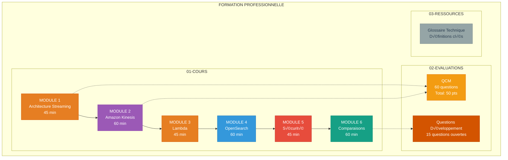
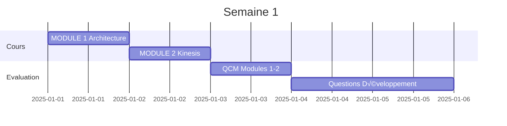
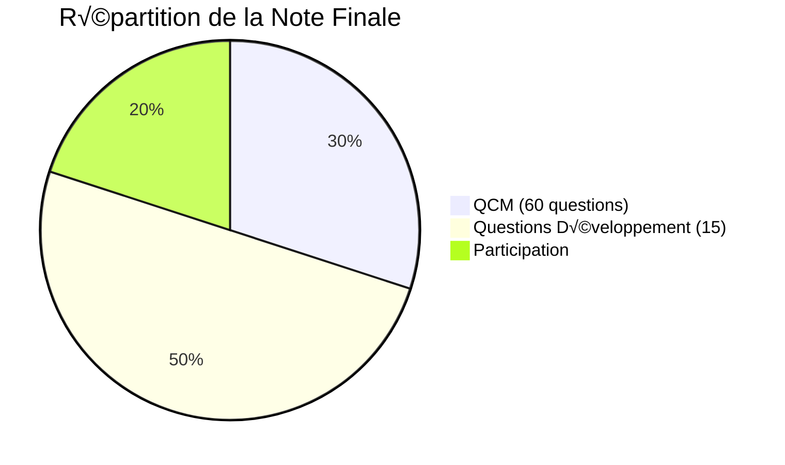

# FORMATION PROFESSIONNELLE
## INGENIERIE DES DONNEES - STREAMING AWS

> Formation condensée et professionnelle sur l'architecture de streaming temps réel avec AWS

---

## PRESENTATION

Cette formation offre une approche **minimaliste et structurée** de l'ingénierie des données en streaming avec AWS. Condensée à partir de 31 chapitres originaux, elle se concentre sur l'essentiel avec **6 modules de cours**, des **QCM** et des **questions de développement**.

### Caractéristiques

- **Format professionnel** : Style GitHub-ready avec diagrammes Mermaid
- **Condensé** : 31 chapitres → 6 modules essentiels (5h15)
- **Visuel** : Diagrammes colorés et professionnels
- **Évaluations complètes** : 60 QCM + 15 questions ouvertes
- **Sans laboratoire** : Focus théorique et architectural

---

## STRUCTURE

```mermaid
graph TB
    subgraph FORMATION["FORMATION PROFESSIONNELLE"]
        subgraph COURS["01-COURS"]
            M1[MODULE 1<br/>Architecture Streaming<br/>45 min]
            M2[MODULE 2<br/>Amazon Kinesis<br/>60 min]
            M3[MODULE 3<br/>Lambda<br/>45 min]
            M4[MODULE 4<br/>OpenSearch<br/>60 min]
            M5[MODULE 5<br/>Sécurité<br/>45 min]
            M6[MODULE 6<br/>Comparaisons<br/>60 min]
        end
        
        subgraph EVAL["02-EVALUATIONS"]
            QCM[QCM<br/>60 questions<br/>Total: 50 pts]
            QD[Questions Développement<br/>15 questions ouvertes]
        end
        
        subgraph RES["03-RESSOURCES"]
            GL[Glossaire Technique<br/>Définitions clés]
        end
    end
    
    M1 --> M2 --> M3 --> M4 --> M5 --> M6
    M1 -.-> QCM
    M2 -.-> QCM
    M6 -.-> QD
    
    style M1 fill:#e67e22,stroke:#d35400,color:#fff
    style M2 fill:#9b59b6,stroke:#8e44ad,color:#fff
    style M3 fill:#e67e22,stroke:#d35400,color:#fff
    style M4 fill:#3498db,stroke:#2980b9,color:#fff
    style M5 fill:#e74c3c,stroke:#c0392b,color:#fff
    style M6 fill:#16a085,stroke:#138d75,color:#fff
    style QCM fill:#f39c12,stroke:#e67e22,color:#fff
    style QD fill:#d35400,stroke:#ba4a00,color:#fff
    style GL fill:#95a5a6,stroke:#7f8c8d,color:#2c3e50
```

---

## ORGANISATION DES DOSSIERS

### 📁 01-COURS

| Module | Titre | Durée | Niveau |
|--------|-------|-------|--------|
| **MODULE-01** | Architecture de Streaming AWS | 45 min | Fondamental |
| **MODULE-02** | Amazon Kinesis | 60 min | Intermédiaire |
| **MODULE-03** | Transformation avec AWS Lambda | 45 min | Intermédiaire |
| **MODULE-04** | OpenSearch et Indexation | 60 min | Intermédiaire-Avancé |
| **MODULE-05** | Sécurité et Encryption | 45 min | Intermédiaire |
| **MODULE-06** | Comparaisons Technologiques | 60 min | Avancé |

**Total** : 5 heures 15 minutes

### üìù 02-EVALUATIONS

#### QCM (Questionnaires à Choix Multiples)

| Fichier | Questions | Durée | Points |
|---------|-----------|-------|--------|
| QCM-MODULE-01 | 10 | 20 min | 10 pts |
| QCM-MODULE-02 | 10 | 20 min | 10 pts |
| QCM-MODULES-03-06 | 40 | 40 min | 40 pts |
| **TOTAL** | **60** | **80 min** | **60 pts** |

#### Questions de Développement

| Fichier | Questions | Note | Durée |
|---------|-----------|------|-------|
| DEV-MODULE-01-Architecture | 2 questions | 20 pts | 45 min |
| DEV-MODULE-02-Kinesis | 2 questions | 20 pts | 45 min |
| DEV-MODULE-03-Lambda | 2 questions | 20 pts | 45 min |
| DEV-MODULE-04-OpenSearch | 2 questions | 20 pts | 50 min |
| DEV-MODULE-05-Securite | 2 questions | 20 pts | 45 min |
| DEV-MODULE-06-Comparaisons | 2 questions | 20 pts | 50 min |
| **TOTAL** | **12 questions** | **120 pts** | **280 min** |

### üìö 03-RESSOURCES

- **GLOSSAIRE-TECHNIQUE.md** : Définitions de tous les concepts clés

---

## PARCOURS PEDAGOGIQUE

### Semaine 1 : Fondamentaux

```mermaid
gantt
    title Semaine 1
    dateFormat YYYY-MM-DD
    section Cours
    MODULE 1 Architecture    :a1, 2025-01-01, 1d
    MODULE 2 Kinesis        :a2, after a1, 1d
    section Evaluation
    QCM Modules 1-2         :e1, after a2, 1d
    Questions Développement :e2, after e1, 2d
```

- **Jour 1** : MODULE 1 - Architecture Streaming
- **Jour 2** : MODULE 2 - Amazon Kinesis
- **Jour 3** : QCM Modules 1-2
- **Jour 4-5** : Questions développement 1-7

### Semaine 2 : Transformation et Indexation

- **Jour 1** : MODULE 3 - Lambda
- **Jour 2** : MODULE 4 - OpenSearch
- **Jour 3-4** : Questions développement 8-11
- **Jour 5** : Projet intégré personnel

### Semaine 3 : Sécurité et Comparaisons

- **Jour 1** : MODULE 5 - Sécurité
- **Jour 2** : MODULE 6 - Comparaisons
- **Jour 3** : QCM final Modules 3-6
- **Jour 4-5** : Questions développement 12-15

---

## OBJECTIFS D'APPRENTISSAGE

### À l'issue de cette formation, vous serez capable de :

- Concevoir des architectures de streaming temps réel sur AWS  
- Choisir entre Kinesis Data Streams et Data Firehose selon le cas d'usage  
- Implémenter des transformations serverless avec Lambda  
- Configurer OpenSearch pour indexation et visualisation  
- Sécuriser une architecture avec IAM, Cognito et encryption  
- Comparer Kinesis, Kafka et autres technologies de streaming  
- Dimensionner et optimiser des pipelines de données  
- Estimer les coûts et performances d'une architecture

---

## PRE-REQUIS

### Connaissances Requises

- **AWS de base** : EC2, S3, IAM
- **Programmation** : Python, Java ou similaire
- **Bases de données** : Concepts SQL/NoSQL
- **Réseaux** : HTTP, API REST

### Connaissances Recommandées

- Systèmes distribués
- JSON et formats de données
- Git et GitHub

---

## EVALUATION

### Notation

```mermaid
pie title Répartition de la Note Finale
    "QCM (60 questions)" : 30
    "Questions Développement (15)" : 50
    "Participation" : 20
```

| Composante | Poids | Détails |
|------------|-------|---------|
| **QCM** | 30% | 60 questions, 60 points |
| **Questions Développement** | 50% | 15 questions, analyse approfondie |
| **Participation** | 20% | Engagement, questions, projets |

### Seuil de Réussite

- **Note minimale** : 12/20
- **QCM minimum** : 30/60 (50%)
- **Questions minimum** : 10/20 par question

---

## RESSOURCES COMPLEMENTAIRES

### Documentation AWS Officielle

- [AWS Kinesis Developer Guide](https://docs.aws.amazon.com/kinesis/)
- [AWS Lambda Developer Guide](https://docs.aws.amazon.com/lambda/)
- [Amazon OpenSearch Service](https://docs.aws.amazon.com/opensearch-service/)
- [AWS Well-Architected Framework](https://aws.amazon.com/architecture/well-architected/)

### Certifications AWS

Cette formation prépare partiellement à :
- **AWS Certified Data Analytics - Specialty**
- **AWS Certified Solutions Architect - Associate**

### Lectures Recommandées

- "Streaming Systems" by Tyler Akidau
- "Designing Data-Intensive Applications" by Martin Kleppmann
- "AWS Certified Data Analytics Study Guide"

---

## SUPPORT ET CONTACT

Pour toute question :
1. Consulter d'abord le **GLOSSAIRE-TECHNIQUE.md**
2. Réviser le module concerné
3. Consulter la documentation AWS officielle

---

## VERSION

| Information | Détail |
|-------------|--------|
| **Version** | 1.0 Professionnelle |
| **Date** | Octobre 2025 |
| **Format** | Condensé minimaliste |
| **Source** | 31 chapitres documentation originale |

---

## LICENCE

**Usage autorisé** : Apprentissage personnel, formation entreprise, enseignement académique  
**Usage interdit** : Revente commerciale, redistribution sans attribution
