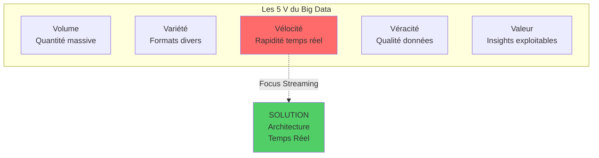
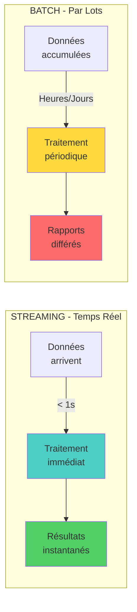
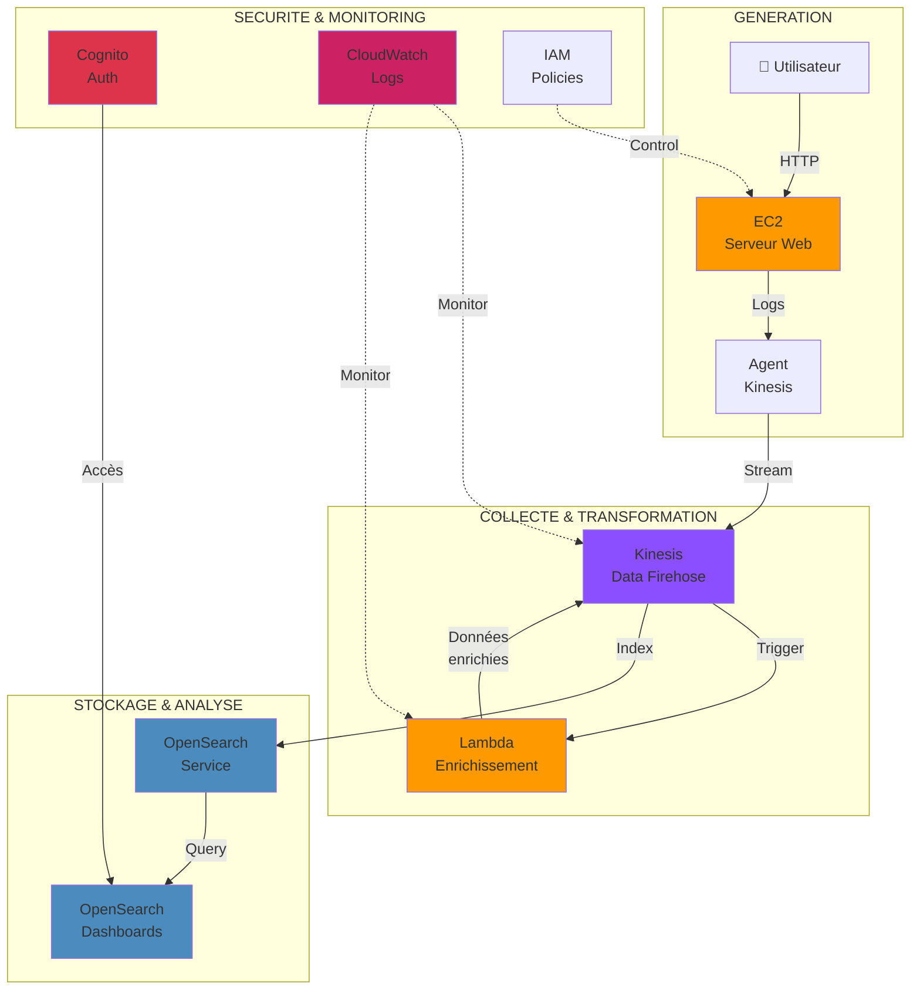
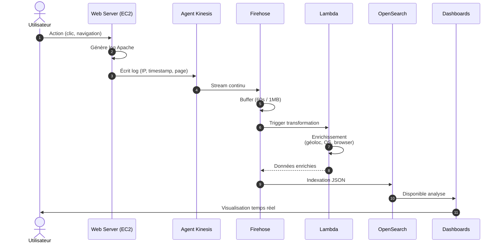
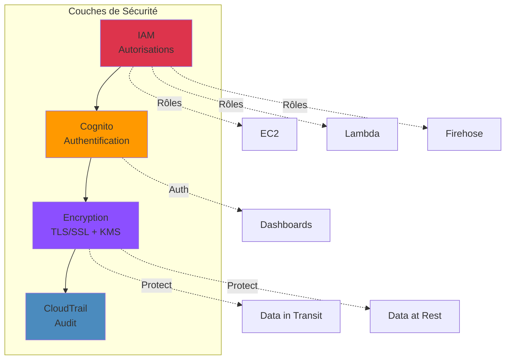

================================================================================
                            MODULE 1
              ARCHITECTURE DE STREAMING AWS
================================================================================

**Durée** : 45 minutes  
**Niveau** : Fondamental  
**Objectifs** : Maîtriser les concepts de base du streaming et l'architecture AWS

================================================================================
## 1. INTRODUCTION AU STREAMING DE DONNEES
================================================================================

### 1.1 Les Cinq V des Mégadonnées

| V | Description | Impact Streaming |
|---|-------------|------------------|
| **Volume** | Quantité massive de données | Scalabilité horizontale requise |
| **Variété** | Différents types et formats | Parsing et transformation flexibles |
| **Vélocité** | Rapidité génération/traitement | **Cœur du streaming (< 1s)** |
| **Véracité** | Qualité et fiabilité | Validation en temps réel |
| **Valeur** | Insights exploitables | Décisions business instantanées |

> **Point clé** : Le streaming répond spécifiquement au défi de la VELOCITE.

### 1.2 Streaming vs Traitement Batch

| Critère | STREAMING (Temps Réel) | BATCH (Par Lots) |
|---------|------------------------|------------------|
| **Traitement** | Continu dès arrivée | Périodique par volumes |
| **Latence** | Millisecondes à secondes | Minutes à heures |
| **Complexité** | Moyenne-élevée | Faible-moyenne |
| **Cas d'usage** | Détection fraude, monitoring IoT, alertes | Rapports quotidiens, analyses historiques, ETL |
| **Technos** | Kinesis, Kafka, Flink | Spark Batch, EMR, Glue |

================================================================================
2. SERVICES AWS POUR LE STREAMING
================================================================================

2.1 Amazon EC2 - Elastic Compute Cloud
---------------------------------------

ROLE : Héberger les applications sources de données
- Serveurs web générant des logs
- Applications métier
- Agents de collecte de données

CARACTERISTIQUES :
- Machines virtuelles configurables
- Intégration avec agent Kinesis
- Sécurité via rôles IAM

2.2 Amazon Kinesis Data Firehose
---------------------------------

ROLE : Service d'ingestion entièrement géré

CARACTERISTIQUES :
- Collecte automatique des données streaming
- Transformation via Lambda (optionnel)
- Livraison directe vers destinations (S3, OpenSearch, Redshift)
- Mise à l'échelle automatique
- Latence : 60 secondes minimum

AVANTAGES :
- Aucune gestion d'infrastructure
- Configuration simplifiée
- Coût basé sur l'usage

2.3 AWS Lambda
--------------

ROLE : Transformation et enrichissement serverless

CARACTERISTIQUES :
- Exécution déclenchée par événements
- Pas de gestion de serveurs
- Facturation à la milliseconde d'exécution
- Intégration native avec Kinesis

CAS D'USAGE STREAMING :
- Enrichissement géolocalisation
- Parsing et validation de données
- Filtrage et agrégation

2.4 Amazon OpenSearch Service
------------------------------

ROLE : Indexation, recherche et analyse

CARACTERISTIQUES :
- Fork d'Elasticsearch hébergé par AWS
- Indexation en temps réel
- Recherche full-text performante
- Dashboards de visualisation intégrés

CONCEPTS CLES :
- Index : Structure d'organisation des données
- Document : Unité de base (format JSON)
- Mappings : Définition des types de champs

2.5 Amazon Cognito
------------------

ROLE : Gestion d'identités et authentification

CARACTERISTIQUES :
- Authentification utilisateurs
- Intégration SSO
- Contrôle d'accès aux dashboards
- Séparation identité/autorisation avec IAM

2.6 Amazon CloudWatch
---------------------

ROLE : Monitoring et observabilité

CARACTERISTIQUES :
- Collecte de logs et métriques
- Monitoring temps réel
- Alertes configurables
- Traçabilité du pipeline

================================================================================
## 3. ARCHITECTURE DE REFERENCE
================================================================================

### 3.1 Workflow Complet

### 3.2 Flux de Données Détaillé

#### Détail des Étapes

| Étape | Composant | Action | Durée | Output |
|-------|-----------|--------|-------|--------|
| **1** | Utilisateur/EC2 | Génération log Apache | < 1ms | `IP, timestamp, page, user-agent` |
| **2** | Agent Kinesis | Collecte continu| < 100ms | Stream vers Firehose |
| **3** | Firehose | Buffer & trigger Lambda | 60s | Batch de records |
| **4** | Lambda | Enrichissement données | 100-500ms | JSON enrichi |
| **5** | OpenSearch | Indexation | < 1s | Document indexé |
| **6** | Dashboards | Visualisation | Instantané | Graphiques temps réel |

### 3.3 Composants de Sécurité

#### Tableau de Sécurité

| Composant | Rôle | Technologies | Best Practice |
|-----------|------|--------------|---------------|
| **IAM** | Autorisations | Rôles, Politiques | Moindre privilège |
| **Cognito** | Authentification | User Pools, MFA | Rotation passwords |
| **KMS** | Encryption clés | CMK, Auto-rotation | Key policies strictes |
| **CloudTrail** | Audit | Logs API | Stockage S3 sécurisé |
| **VPC** | Isolation réseau | Security Groups | Principe zero-trust |

================================================================================
4. CAS D'USAGE METIER
================================================================================

4.1 Analyse de Logs Web
-----------------------

PROBLEMATIQUE :
Comprendre le comportement des visiteurs sans scripts tiers bloqués

SOLUTION :
- Logs serveur Apache (données fiables)
- Enrichissement géolocalisation/appareil
- Visualisation temps réel des tendances

BENEFICES :
- Données précises et complètes
- Conformité RGPD (données first-party)
- Analyse comportementale avancée

4.2 Détection d'Anomalies IoT
------------------------------

FLUX :
Capteurs IoT → Kinesis Streams → Lambda (détection) → Alertes SNS
                              → Firehose → S3 (archivage)

4.3 Personnalisation E-commerce
--------------------------------

FLUX :
Clics utilisateur → Kinesis → Lambda (calcul recommandations)
                            → DynamoDB (profil utilisateur)
                            → OpenSearch (historique recherche)

================================================================================
5. CONCEPTS CLES A RETENIR
================================================================================

PIPELINE DE STREAMING
- Architecture orientée événements
- Traitement continu et automatisé
- Scalabilité horizontale

SERVICES GERES vs AUTO-HEBERGES
- Firehose : entièrement géré, simple
- Kinesis Streams : plus de contrôle, nécessite consommateurs

TRANSFORMATION EN VOL
- Lambda pour enrichissement temps réel
- Évite le stockage de données brutes puis traitement
- Réduit latence et coûts de stockage

OBSERVABILITE
- CloudWatch essentiel pour production
- Logs structurés pour debugging
- Métriques pour optimisation

SECURITE PAR CONCEPTION
- IAM pour autorisation
- Cognito pour authentification
- Encryption bout en bout

================================================================================
6. EXERCICES DE REFLEXION
================================================================================

1. Pourquoi utiliser Kinesis Firehose plutôt que stocker directement dans S3 
   depuis EC2 ?

2. Quels sont les avantages de transformer les données avec Lambda avant 
   indexation dans OpenSearch ?

3. Dans quels cas préféreriez-vous Kinesis Data Streams à Kinesis Data Firehose ?

4. Comment assurer la haute disponibilité de cette architecture ?

5. Quelles métriques CloudWatch sont critiques pour surveiller ce pipeline ?

================================================================================
POINTS CLES DU MODULE
================================================================================

- Le streaming répond aux besoins de traitement temps réel (vélocité)
- AWS offre des services managés pour chaque étape du pipeline
- Architecture standard : Collecte → Transformation → Indexation → Visualisation
- Lambda permet l'enrichissement serverless des données en vol
- OpenSearch indexe pour recherche et analyse rapides
- Sécurité intégrée via IAM, Cognito et encryption
- CloudWatch assure l'observabilité du système

================================================================================
RESSOURCES COMPLEMENTAIRES
================================================================================

- AWS Kinesis Documentation
- OpenSearch Service Best Practices
- Lambda Streaming Use Cases
- CloudWatch Logs Insights

================================================================================

