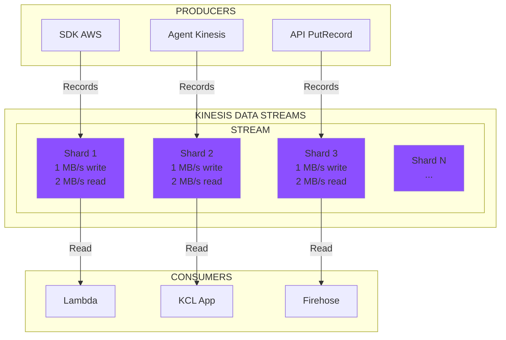
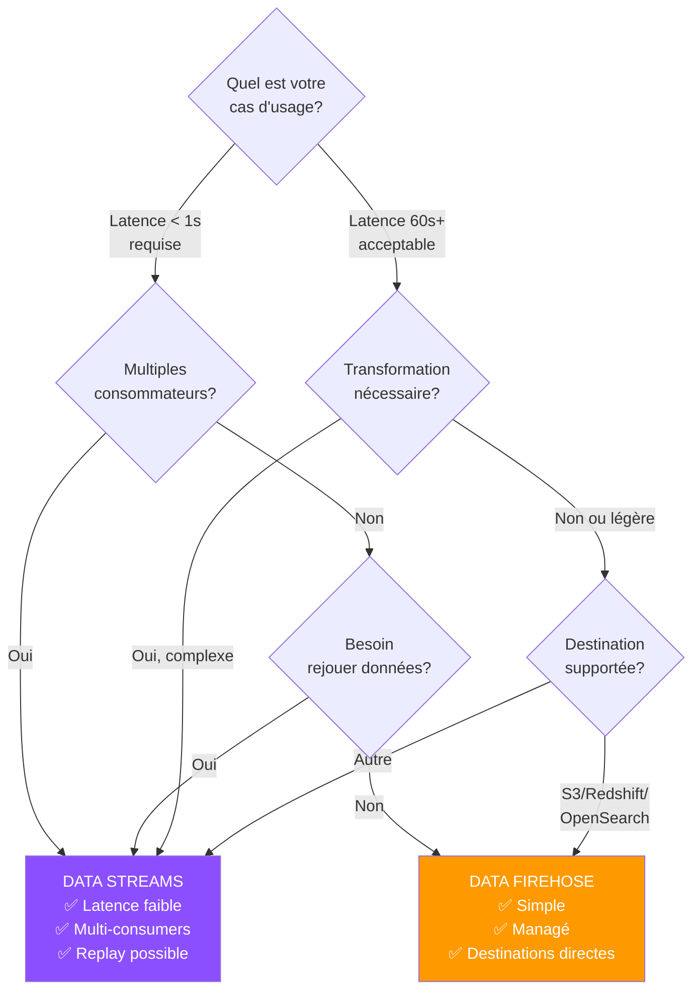

================================================================================
                            MODULE 2
                      AMAZON KINESIS
================================================================================

Durée : 60 minutes
Niveau : Intermédiaire

================================================================================
1. PRESENTATION D'AMAZON KINESIS
================================================================================

1.1 Vue d'Ensemble
------------------

Amazon Kinesis est une suite de services pour collecter, traiter et analyser
des données en streaming temps réel à grande échelle.

FAMILLE DE SERVICES :
- Kinesis Data Streams
- Kinesis Data Firehose
- Kinesis Data Analytics
- Kinesis Video Streams

FOCUS DE CE MODULE : Data Streams et Data Firehose

1.2 Positionnement
------------------

ALTERNATIVE MANAGEE A : Apache Kafka, RabbitMQ
AVANTAGES AWS : Intégration native, pas de gestion infrastructure
COMPROMIS : Moins de flexibilité que Kafka

================================================================================
2. KINESIS DATA STREAMS
================================================================================

### 2.1 Architecture et Concepts

> **Définition** : Service de streaming distribué permettant la collecte et le traitement de données en temps réel avec rétention.

#### Composants Clés

| Composant | Description | Spécifications |
|-----------|-------------|----------------|
| **STREAM** | Ensemble de shards | Point d'entrée, nommage unique/région |
| **SHARD** | Unité de capacité | Write: 1 MB/s ou 1000 records/s Read: 2 MB/s |
| **RECORD** | Unité de données | Max 1 MB, structure: clé partition + séquence + data |
| **PRODUCER** | Écrit dans stream | SDK, Agent, API |
| **CONSUMER** | Lit depuis stream | Lambda, KCL, Firehose |

2.2 Caractéristiques Techniques
--------------------------------

RETENTION
- Par défaut : 24 heures
- Extensible : jusqu'à 365 jours
- Rejoue possible des données conservées

LATENCE
- Ecriture/lecture : < 1 seconde
- Adapté au traitement temps réel strict

DUREE DE VIE
- Données persistent dans le stream
- Multiples consommateurs peuvent lire en parallèle

MISE A L'ECHELLE
- Manuelle : ajouter/supprimer shards
- Provisionnement de capacité requis
- Planification selon charge prévue

2.3 Cas d'Usage Data Streams
-----------------------------

1. TRAITEMENT TEMPS REEL STRICT
   - Latence < 1 seconde requise
   - Analyse en continu (ML, détection anomalies)

2. MULTIPLES CONSOMMATEURS
   - Plusieurs applications lisent même flux
   - Logiques de traitement différentes

3. REJOUE DE DONNEES
   - Retraitement nécessaire
   - Correction d'erreurs de logique

4. CONTROLE FIN
   - Gestion manuelle du checkpoint
   - Traitement personnalisé par shard

EXEMPLE :
Stream de transactions bancaires → Lambda (détection fraude)
                                 → Firehose (archivage S3)
                                 → Application analytics

================================================================================
3. KINESIS DATA FIREHOSE
================================================================================

3.1 Architecture et Concepts
-----------------------------

DEFINITION :
Service entièrement géré de livraison de données en streaming vers
destinations de stockage et d'analyse.

COMPOSANTS :

DELIVERY STREAM
- Pipeline complet source → destination
- Configuration déclarative
- Gestion automatique

SOURCE
- Direct PUT (API, agent)
- Kinesis Data Streams
- Amazon MSK

DESTINATION
- Amazon S3
- Amazon Redshift
- Amazon OpenSearch Service
- Services tiers (Splunk, Datadog, etc.)
- HTTP endpoints

TRANSFORMATION (optionnel)
- Fonction Lambda inline
- Enrichissement, parsing, filtrage

3.2 Caractéristiques Techniques
--------------------------------

GESTION
- Entièrement managé, serverless
- Mise à l'échelle automatique
- Pas de provisionnement de capacité

LATENCE
- Buffer : 60 secondes minimum ou 1 MB
- Adapté au near real-time (pas strict real-time)

RETENTION
- Pas de rétention persistante
- Données transitent et sont livrées
- Retry automatique en cas d'échec

TRANSFORMATION
- Lambda appelé avant livraison
- Timeout : 5 minutes max par invocation
- Données transformées retournées à Firehose

BATCHING
- Regroupement automatique des records
- Optimisation pour destination (ex: fichiers S3)
- Configuration buffer size/interval

3.3 Cas d'Usage Data Firehose
------------------------------

1. INGESTION SIMPLE VERS STOCKAGE
   - Logs vers S3 pour archivage
   - Pas de traitement complexe requis

2. CHARGEMENT DATA WAREHOUSE
   - Streaming vers Redshift
   - ETL simplifié via Lambda

3. INDEXATION TEMPS REEL
   - Logs vers OpenSearch
   - Recherche et visualisation

4. PIPELINE SANS GESTION INFRA
   - Startup, équipes réduites
   - Focus sur logique métier

EXEMPLE :
Logs Apache → Firehose → Lambda (enrichissement géoloc) → OpenSearch

================================================================================
4. COMPARAISON DATA STREAMS VS DATA FIREHOSE
================================================================================

### 4.1 Tableau Comparatif

| Critère | **DATA STREAMS** | **DATA FIREHOSE** |
|---------|------------------|-------------------|
| **Gestion** | Semi-managé | ✅ Entièrement managé |
| **Provisionnement** | Shards manuels | ✅ Automatique |
| **Latence** | ✅ < 1 seconde | 60+ secondes |
| **Rétention** | ✅ 24h - 365j | ❌ Aucune |
| **Consommateurs** | ✅ Multiples | Destination unique |
| **Rejoue données** | ✅ Oui | ❌ Non |
| **Code consommateur** | Requis | ✅ Non requis |
| **Destinations** | ✅ Flexible | Prédéfinies (S3, etc.) |
| **Transformation** | Via consommateur | ✅ Lambda intégré |
| **Complexité** | Moyenne-élevée | ✅ Faible |
| **Coût** | Basé sur shards | Basé sur volume |

### 4.2 Arbre de Décision

#### Quand choisir DATA STREAMS ?

✅ Latence < 1 seconde requise  
✅ Plusieurs consommateurs avec logiques différentes  
✅ Besoin de rejouer les données  
✅ Traitement complexe personnalisé  
✅ Contrôle fin du flux de données

#### Quand choisir DATA FIREHOSE ?

✅ Livraison simple vers S3/Redshift/OpenSearch  
✅ Pas d'expertise en systèmes distribués  
✅ Near real-time suffisant (60s latence)  
✅ Transformation Lambda légère  
✅ Focus sur simplicité opérationnelle

4.3 Architecture Combinée
--------------------------

PATTERN COURANT : Utiliser les deux ensemble

FLUX :
Source → Data Streams → Consommateur Lambda (traitement temps réel)
                     → Firehose (archivage S3 automatique)

AVANTAGES :
- Traitement temps réel avec Data Streams
- Archivage automatique avec Firehose
- Meilleur des deux mondes

EXEMPLE :
IoT sensors → Data Streams → Lambda (alertes < 1s)
                          → Firehose → S3 (analyse historique)

================================================================================
5. CONFIGURATION ET BONNES PRATIQUES
================================================================================

5.1 Data Streams - Dimensionnement
-----------------------------------

CALCUL SHARDS NECESSAIRES :

Shards écriture = (Volume données MB/s) / 1 MB/s
Shards lecture   = (Volume données MB/s) / 2 MB/s

Prendre le maximum des deux.

EXEMPLE :
- 5 MB/s en écriture
- 3 applications consommatrices
- Données lues 3 fois = 15 MB/s lecture

Shards écriture = 5 / 1 = 5
Shards lecture  = 15 / 2 = 8

RESULTAT : 8 shards nécessaires

5.2 Data Streams - Clés de Partition
-------------------------------------

ROLE : Distribuer les données entre shards

STRATEGIES :

RANDOM :
- Distribution uniforme
- Pas d'ordre garanti

PAR ENTITE (ex: user_id) :
- Tous les records d'un utilisateur dans même shard
- Ordre garanti par utilisateur
- Risque de "hot partition"

PAR DOMAINE (ex: région) :
- Isolation par domaine métier
- Permet traitement parallèle ciblé

5.3 Data Firehose - Configuration
----------------------------------

BUFFER :
- Buffer size : 1-128 MB
- Buffer interval : 60-900 secondes
- Compromis latence/efficacité

TRANSFORMATION LAMBDA :
- Timeout adapté au traitement
- Gestion erreurs et retry
- Logging CloudWatch

DESTINATION S3 :
- Partitionnement par date/heure
- Compression (GZIP, Snappy)
- Encryption au repos

5.4 Sécurité
------------

ENCRYPTION EN TRANSIT :
- TLS/SSL automatique
- Connexions sécurisées

ENCRYPTION AU REPOS :
- Data Streams : server-side encryption avec KMS
- Firehose : encryption à la destination

IAM :
- Rôles pour producers/consumers
- Politiques granulaires par stream
- Principe moindre privilège

MONITORING :
- CloudWatch Metrics (GetRecords, PutRecords)
- CloudWatch Logs (erreurs transformation)
- Alertes sur anomalies

================================================================================
6. PATTERNS D'ARCHITECTURE
================================================================================

6.1 Pattern : Fan-Out (Data Streams)
-------------------------------------

STRUCTURE :
1 Producer → Data Streams → Multiple Consumers (Lambda, Firehose, Custom)

USAGE :
- Distribuer même flux à plusieurs systèmes
- Logiques de traitement indépendantes

EXEMPLE :
Logs application → Streams → Lambda (métriques temps réel)
                           → Firehose (archivage S3)
                           → Analytics (alerting)

6.2 Pattern : Transformation Pipeline (Firehose)
-------------------------------------------------

STRUCTURE :
Source → Firehose → Lambda (transform) → Destination

USAGE :
- Enrichissement avant stockage
- Parsing et validation
- Filtrage de données

EXEMPLE :
Logs bruts → Firehose → Lambda (ajout géoloc, parsing) → OpenSearch

6.3 Pattern : Lambda as Router
-------------------------------

STRUCTURE :
Streams → Lambda → Routage conditionnel vers destinations multiples

USAGE :
- Tri intelligent des données
- Distribution selon règles métier

EXEMPLE :
Transactions → Streams → Lambda → S3 (archivage toutes)
                                → DynamoDB (transactions > 1000€)
                                → SNS (alertes fraude)

================================================================================
7. POINTS CLES DU MODULE
================================================================================

- Data Streams pour traitement temps réel strict et multiples consommateurs
- Data Firehose pour livraison simple et managée vers destinations
- Compromis latence vs simplicité opérationnelle
- Possibilité de combiner les deux services
- Dimensionnement basé sur charge et cas d'usage
- Sécurité via encryption et IAM
- Monitoring CloudWatch essentiel

================================================================================
8. EXERCICES DE REFLEXION
================================================================================

1. Votre application doit traiter 10 MB/s de données avec 2 consommateurs.
   Combien de shards Data Streams provisionneriez-vous ?

2. Quand choisiriez-vous Data Streams seul plutôt que Data Firehose seul ?

3. Comment architecturer un système nécessitant à la fois alertes temps réel
   et archivage historique ?

4. Quels risques posent les "hot partitions" dans Data Streams et comment
   les éviter ?

5. Pour un système de logs web, justifiez le choix entre Direct PUT vers
   Firehose ou passage par Data Streams.

================================================================================

