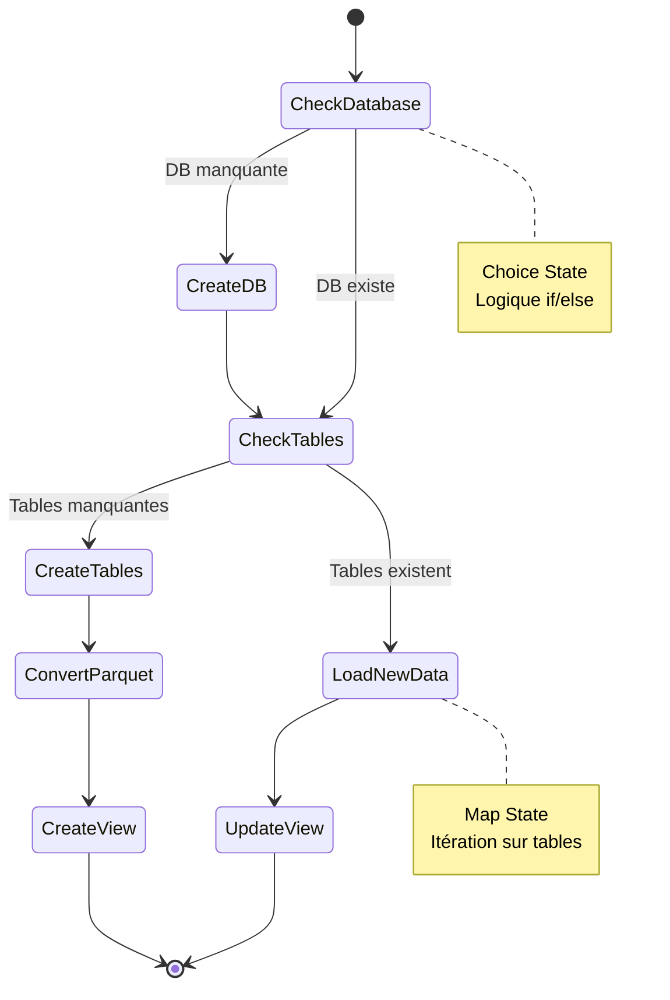
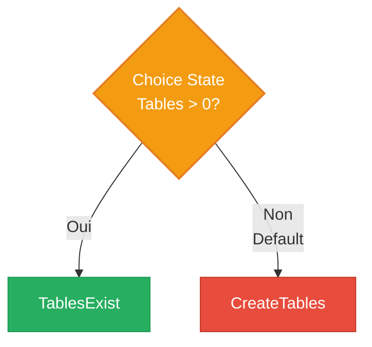
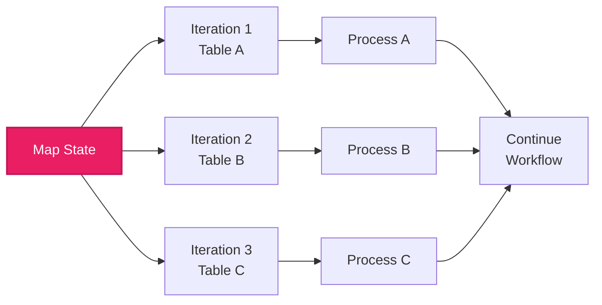
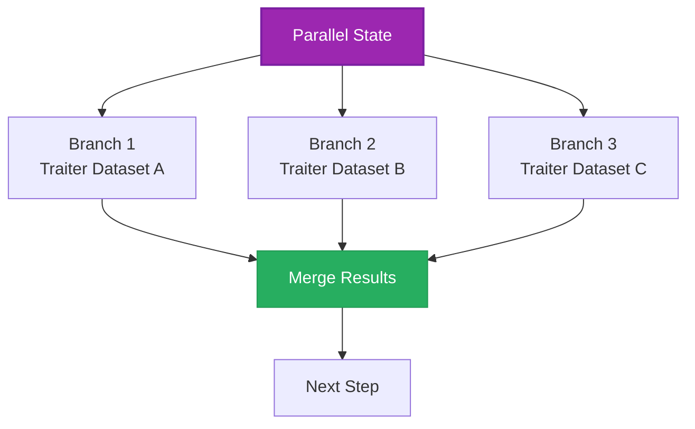
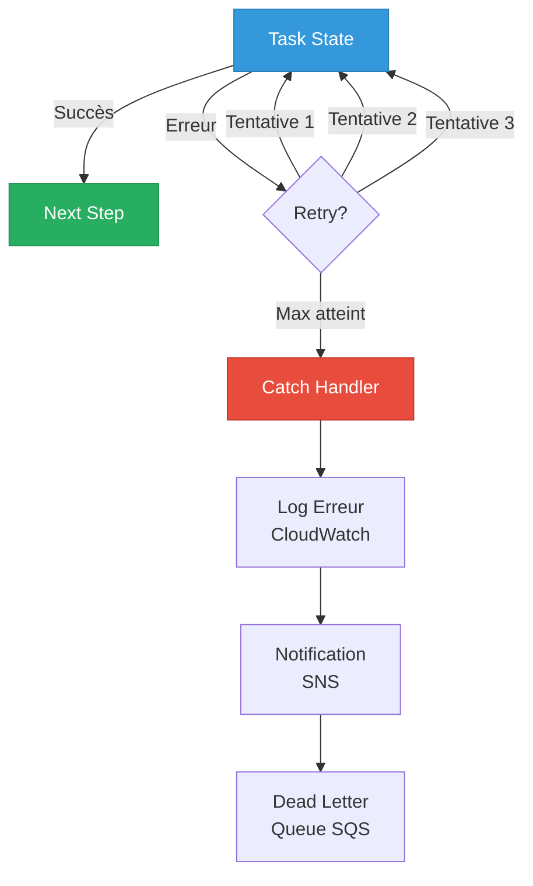
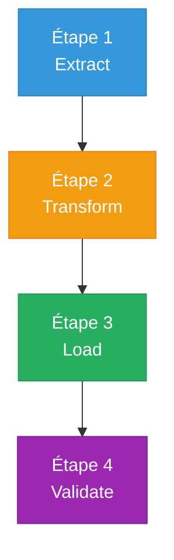
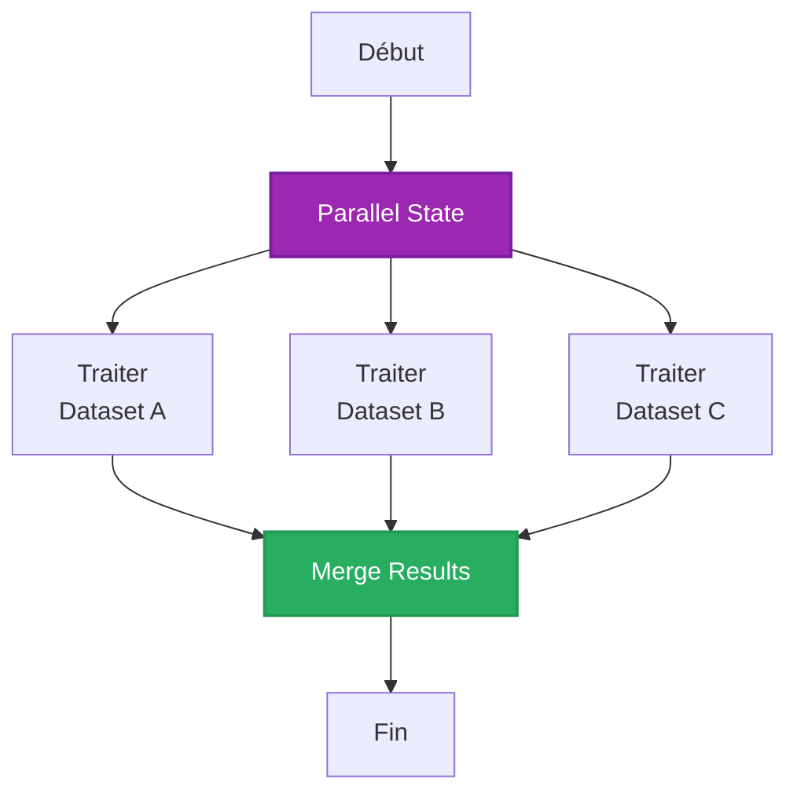
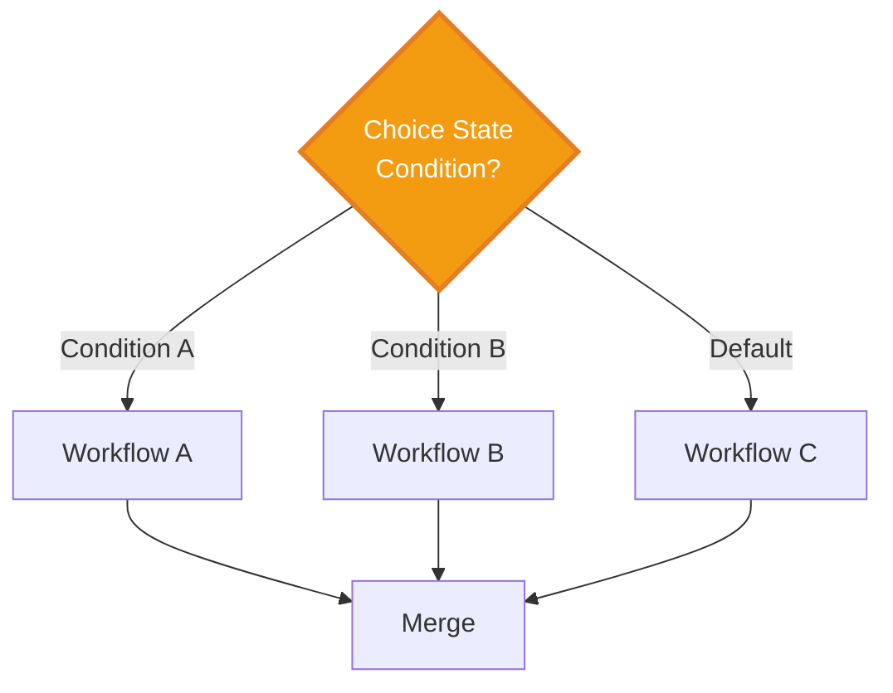
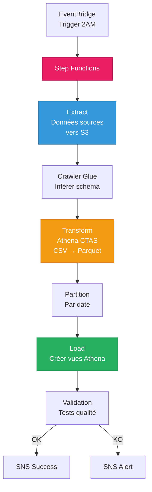

# MODULE 2 - AWS STEP FUNCTIONS

**Durée** : 60 minutes  
**Niveau** : Intermédiaire  
**Objectifs** : Maîtriser Step Functions pour orchestration de workflows ETL

---

# 1. INTRODUCTION AWS STEP FUNCTIONS

## 1.1 Définition

**AWS Step Functions** = Service d'orchestration de workflows serverless basé sur des machines à états.

**Utilité** :
- Coordonner services AWS multiples
- Gérer logique conditionnelle complexe
- Retry et gestion d'erreurs automatiques
- Visualisation workflow en temps réel

### Positionnement

| Service | Type | Usage |
|---------|------|-------|
| **Step Functions** | Orchestration workflow | Coordonner étapes ETL, processus métier |
| **Lambda** | Compute serverless | Exécuter code custom |
| **EventBridge** | Event bus | Router événements entre services |
| **SQS** | File d'attente | Découpler composants |

---

## 1.2 Architecture State Machine



---

# 2. TYPES D'ETATS

## 2.1 Task State

**Exécute une unité de travail**

```json
{
  "Type": "Task",
  "Resource": "arn:aws:states:::athena:startQueryExecution.sync",
  "Parameters": {
    "QueryString": "CREATE DATABASE mydb",
    "WorkGroup": "primary"
  },
  "Next": "NextStep"
}
```

**Intégrations natives** :
- Lambda (invoke function)
- Athena (requêtes SQL)
- Glue (jobs ETL, crawlers)
- DynamoDB (CRUD operations)
- SQS, SNS (messaging)
- ECS, Batch (containers)

---

## 2.2 Choice State

**Logique conditionnelle (if/else)**

```json
{
  "Type": "Choice",
  "Choices": [
    {
      "Variable": "$.ResultSet.Rows",
      "NumericGreaterThan": 0,
      "Next": "TablesExist"
    }
  ],
  "Default": "CreateTables"
}
```



**Opérateurs disponibles** :
- String: Equals, LessThan, GreaterThan, Matches
- Numeric: Equals, LessThan, GreaterThan
- Boolean: Equals
- Timestamp: Before, After
- And, Or, Not (combinaisons)

---

## 2.3 Map State

**Itération sur array**

```json
{
  "Type": "Map",
  "ItemsPath": "$.tables",
  "Iterator": {
    "StartAt": "ProcessTable",
    "States": {
      "ProcessTable": {
        "Type": "Task",
        "Resource": "arn:aws:lambda:...",
        "End": true
      }
    }
  },
  "Next": "Done"
}
```



**Usage** : Traiter chaque table Glue, chaque fichier S3, chaque partition

---

## 2.4 Parallel State

**Exécution parallèle de branches**

```json
{
  "Type": "Parallel",
  "Branches": [
    {
      "StartAt": "ProcessDataA",
      "States": { ... }
    },
    {
      "StartAt": "ProcessDataB",
      "States": { ... }
    }
  ],
  "Next": "MergeResults"
}
```



---

## 2.5 Wait State

**Pause temporelle**

```json
{
  "Type": "Wait",
  "Seconds": 300,
  "Next": "NextStep"
}
```

**Usage** : Attendre disponibilité ressource, rate limiting APIs

---

## 2.6 Pass State

**Passe données sans action**

```json
{
  "Type": "Pass",
  "Result": {"status": "skipped"},
  "Next": "NextStep"
}
```

**Usage** : Placeholder, debug, transformation simple données

---

# 3. INTEGRATION ATHENA

## 3.1 StartQueryExecution (Synchrone)

```json
{
  "Type": "Task",
  "Resource": "arn:aws:states:::athena:startQueryExecution.sync",
  "Parameters": {
    "QueryString": "SELECT * FROM mytable LIMIT 10",
    "WorkGroup": "primary",
    "ResultConfiguration": {
      "OutputLocation": "s3://bucket/results/"
    }
  },
  "Next": "ProcessResults"
}
```

**Avec `.sync`** :
- Step Functions attend fin requête
- Retourne `QueryExecutionId`
- Timeout max : 1 an (pratique : minutes)

---

## 3.2 GetQueryResults

```json
{
  "Type": "Task",
  "Resource": "arn:aws:states:::athena:getQueryResults",
  "Parameters": {
    "QueryExecutionId.$": "$.QueryExecution.QueryExecutionId"
  },
  "Next": "EvaluateResults"
}
```

**Retourne** : Résultats de la requête en JSON

---

# 4. GESTION D'ERREURS

## 4.1 Retry et Catch

```json
{
  "Type": "Task",
  "Resource": "arn:aws:states:::athena:startQueryExecution.sync",
  "Retry": [
    {
      "ErrorEquals": ["States.Timeout"],
      "IntervalSeconds": 60,
      "MaxAttempts": 3,
      "BackoffRate": 2.0
    }
  ],
  "Catch": [
    {
      "ErrorEquals": ["States.ALL"],
      "Next": "HandleError"
    }
  ],
  "Next": "Success"
}
```

**Retry** : Tentatives automatiques avec backoff exponentiel  
**Catch** : Routage vers état d'erreur si échec persistant

---

## 4.2 Patterns de Gestion d'Erreurs



---

# 5. EXEMPLE WORKFLOW ETL COMPLET

## 5.1 Workflow NYC Taxis

```json
{
  "Comment": "Pipeline ETL Taxis NYC",
  "StartAt": "CreateDatabase",
  "States": {
    "CreateDatabase": {
      "Type": "Task",
      "Resource": "arn:aws:states:::athena:startQueryExecution.sync",
      "Parameters": {
        "QueryString": "CREATE DATABASE IF NOT EXISTS nyctaxidb"
      },
      "Next": "CheckTables"
    },
    "CheckTables": {
      "Type": "Task",
      "Resource": "arn:aws:states:::athena:startQueryExecution.sync",
      "Parameters": {
        "QueryString": "SHOW TABLES IN nyctaxidb"
      },
      "Next": "GetTableResults"
    },
    "GetTableResults": {
      "Type": "Task",
      "Resource": "arn:aws:states:::athena:getQueryResults",
      "Next": "ChoiceFirstRun"
    },
    "ChoiceFirstRun": {
      "Type": "Choice",
      "Choices": [{
        "Variable": "$.ResultSet.Rows[0]",
        "IsPresent": false,
        "Next": "CreateTables"
      }],
      "Default": "LoadNewData"
    },
    "CreateTables": {
      "Type": "Task",
      "Resource": "arn:aws:states:::athena:startQueryExecution.sync",
      "Next": "ConvertToParquet"
    },
    "ConvertToParquet": {
      "Type": "Task",
      "Resource": "arn:aws:states:::athena:startQueryExecution.sync",
      "Next": "CreateView"
    },
    "CreateView": {
      "Type": "Task",
      "Resource": "arn:aws:states:::athena:startQueryExecution.sync",
      "End": true
    },
    "LoadNewData": {
      "Type": "Map",
      "ItemsPath": "$.ResultSet.Rows",
      "Iterator": {
        "StartAt": "InsertData",
        "States": {
          "InsertData": {
            "Type": "Task",
            "Resource": "arn:aws:states:::athena:startQueryExecution.sync",
            "End": true
          }
        }
      },
      "End": true
    }
  }
}
```

---

# 6. VISUALISATION WORKFLOW STUDIO

## 6.1 Interface Workflow Studio

**Step Functions Workflow Studio** = Éditeur visuel drag-and-drop

```
┌─────────────────────────────────────────────────────┐
│  ACTIONS (Gauche)        CANVAS (Centre)            │
│  ┌──────────────┐      ┌────────────────────┐      │
│  │ Task         │      │  [Start]           │      │
│  │ Choice       │      │     ↓              │      │
│  │ Parallel     │      │  [CheckDB]         │      │
│  │ Map          │  →   │     ↓              │      │
│  │ Wait         │      │  [CreateTables]    │      │
│  │ Pass         │      │     ↓              │      │
│  └──────────────┘      │  [End]             │      │
│                        └────────────────────┘      │
│                                                     │
│                        INSPECTOR (Droite)          │
│                        ┌────────────────┐          │
│                        │ State name:    │          │
│                        │ CheckDB        │          │
│                        │                │          │
│                        │ Parameters:    │          │
│                        │ {...}          │          │
│                        └────────────────┘          │
└─────────────────────────────────────────────────────┘
```

---

# 7. PATTERNS D'ORCHESTRATION

## 7.1 Pattern Sequential



**Usage** : Pipeline linéaire avec dépendances

---

## 7.2 Pattern Fan-Out/Fan-In



**Usage** : Traitement parallèle pour performance

---

## 7.3 Pattern Conditional



**Usage** : Logique métier complexe, routage dynamique

---

# 8. MONITORING ET OBSERVABILITE

## 8.1 Métriques CloudWatch

| Métrique | Description | Usage |
|----------|-------------|-------|
| **ExecutionsStarted** | Nombre d'exécutions lancées | Monitoring activité |
| **ExecutionsSucceeded** | Exécutions réussies | Taux de succès |
| **ExecutionsFailed** | Exécutions échouées | Détection problèmes |
| **ExecutionTime** | Durée d'exécution | Performance |
| **ExecutionsTimedOut** | Timeout dépassé | Optimisation durées |

---

## 8.2 Logging CloudWatch

```json
{
  "LoggingConfiguration": {
    "Level": "ALL",
    "IncludeExecutionData": true,
    "Destinations": [
      {
        "CloudWatchLogsLogGroup": {
          "LogGroupArn": "arn:aws:logs:..."
        }
      }
    ]
  }
}
```

**Niveaux** :
- **OFF** : Pas de logs
- **ERROR** : Uniquement erreurs
- **ALL** : Tous événements (debug)

---

# 9. OPTIMISATION WORKFLOWS

## 9.1 Performance

**Parallélisation** :
```
Au lieu de : Step1 → Step2 → Step3 (séquentiel)
Utiliser : Parallel(Step1, Step2, Step3) (simultané)
```

**Gains** : 3x plus rapide si étapes indépendantes

**Map vs Sequential** :

| Approche | Durée | Code |
|----------|-------|------|
| **Sequential** | N × temps/item | N états distincts |
| **Map State** | temps/item (parallèle) | 1 état Map |

---

## 9.2 Coûts

**Pricing Step Functions** :
- **Standard Workflows** : 0.025 USD / 1000 transitions d'états
- **Express Workflows** : 1 USD / 1M exécutions + durée

**Exemple** :
- Workflow 10 états
- 100K exécutions/mois
- Coût : 100K × 10 ÷ 1000 × 0.025 = **25 USD/mois**

**Optimisation** :
- Grouper états quand possible
- Utiliser Express pour haute fréquence
- Éviter Wait states inutiles

---

# 10. INTEGRATION GLUE

## 10.1 Déclencher Glue Crawler

```json
{
  "Type": "Task",
  "Resource": "arn:aws:states:::aws-sdk:glue:startCrawler",
  "Parameters": {
    "Name": "my-crawler"
  },
  "Next": "WaitCrawler"
}
```

---

## 10.2 Déclencher Glue Job

```json
{
  "Type": "Task",
  "Resource": "arn:aws:states:::glue:startJobRun.sync",
  "Parameters": {
    "JobName": "etl-job",
    "Arguments": {
      "--input": "s3://bucket/raw/",
      "--output": "s3://bucket/processed/"
    }
  },
  "Next": "ValidateResults"
}
```

---

# 11. EXEMPLES PRATIQUES

## 11.1 Pipeline ETL Quotidien



---

# 12. POINTS CLES DU MODULE

- Step Functions orchestre workflows complexes avec état
- 7 types d'états : Task, Choice, Parallel, Map, Wait, Pass, Succeed/Fail
- Intégration native avec Athena, Glue, Lambda, etc.
- Retry automatique et gestion d'erreurs robuste
- Map State pour itérations, Parallel pour performance
- Monitoring CloudWatch intégré
- Pricing basé sur transitions d'états
- Workflow Studio pour design visuel drag-and-drop

---

# 13. EXERCICES DE REFLEXION

1. Dessinez workflow Step Functions pour :
   - Vérifier si DB Glue existe
   - Si non : créer DB + tables
   - Si oui : vérifier nouvelles données
   - Insérer nouvelles données si présentes

2. Comparez coût :
   - Workflow 15 états, 50K exécutions/mois (Standard)
   - vs Express Workflows (1M exécutions, 100ms chacune)

3. Vous devez traiter 100 fichiers S3 en parallèle. Map ou Parallel ?

4. Workflow prend 45 min alors que requête Athena prend 2 min. Diagnostic ?

5. Implémentez retry avec backoff exponentiel pour requête Athena (timeout possible).

