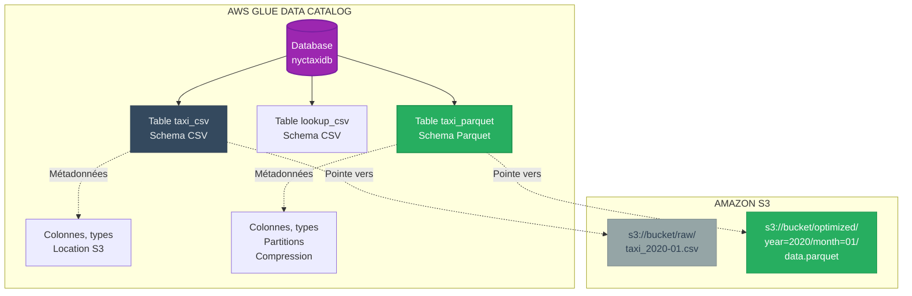
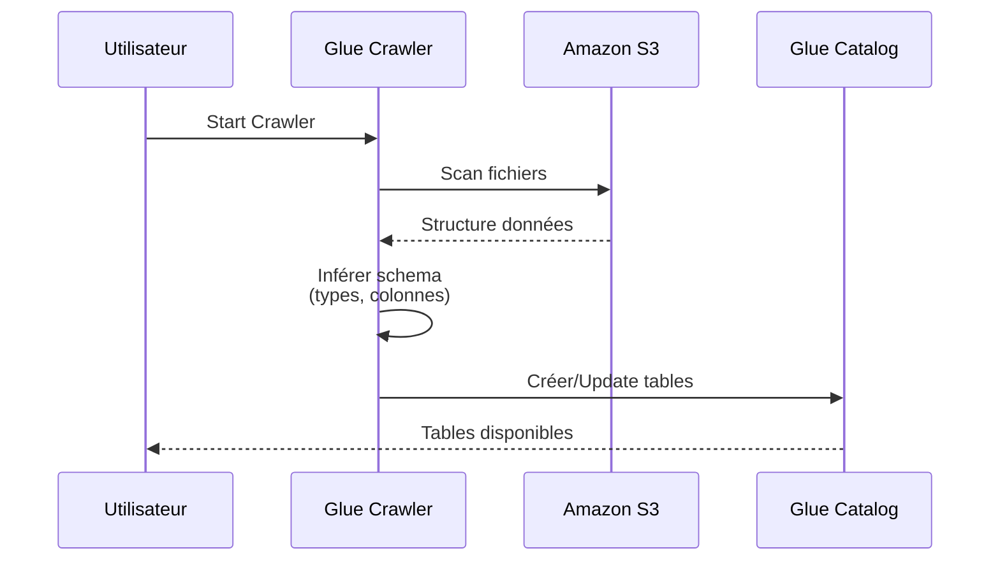
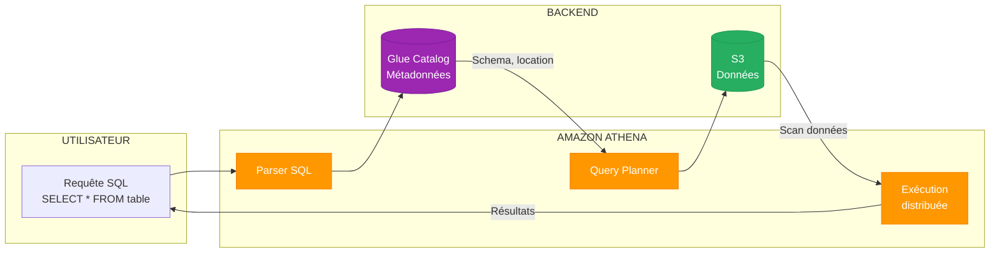
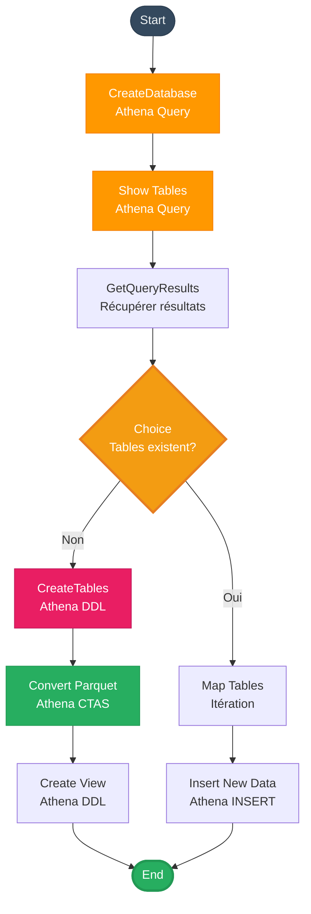

# MODULE 3 - AWS GLUE & AMAZON ATHENA

**Durée** : 60 minutes  
**Niveau** : Intermédiaire  
**Objectifs** : Maîtriser Glue Data Catalog et requêtes Athena sur S3

---

# 1. AWS GLUE DATA CATALOG

## 1.1 Architecture Glue



> **Point clé** : Glue Catalog stocke MÉTADONNÉES, pas données. Données restent dans S3.

---

## 1.2 Création Table Glue via Athena

**CREATE EXTERNAL TABLE** :

```sql
CREATE EXTERNAL TABLE nyctaxidb.taxi_data_csv (
  vendorid BIGINT,
  pickup_datetime STRING,
  dropoff_datetime STRING,
  passenger_count BIGINT,
  trip_distance DOUBLE,
  fare_amount DOUBLE
)
ROW FORMAT DELIMITED
FIELDS TERMINATED BY ','
LOCATION 's3://bucket/data/'
TBLPROPERTIES ('skip.header.line.count'='1');
```

**Éléments clés** :

| Élément | Description |
|---------|-------------|
| **EXTERNAL** | Données restent dans S3 (pas copiées) |
| **ROW FORMAT** | Format parsing (CSV, JSON, etc.) |
| **LOCATION** | Chemin S3 des données |
| **TBLPROPERTIES** | Skip header pour CSV |

---

## 1.3 Glue Crawlers

**Crawler** = Scan automatique S3 pour inférer schema



**Avantages** :
- Découverte automatique schema
- Mise à jour auto si nouvelles données
- Support multi-formats

**Inconvénients** :
- Parfois imprécis (inférence)
- Coût crawls fréquents

---

# 2. AMAZON ATHENA

## 2.1 Fonctionnement

**Athena** = Moteur SQL serverless sur S3



---

## 2.2 Types de Requêtes

### DDL (Data Definition Language)

```sql
-- Créer database
CREATE DATABASE IF NOT EXISTS mydb;

-- Créer table
CREATE EXTERNAL TABLE mydb.mytable (
  id INT,
  name STRING
) LOCATION 's3://bucket/data/';

-- Supprimer table
DROP TABLE mydb.mytable;

-- Afficher tables
SHOW TABLES IN mydb;
```

### DML (Data Manipulation Language)

```sql
-- SELECT
SELECT * FROM taxi_data WHERE fare > 50;

-- INSERT (CTAS - Create Table As Select)
CREATE TABLE taxi_parquet
WITH (format='PARQUET')
AS SELECT * FROM taxi_csv;

-- INSERT INTO (ajout données)
INSERT INTO taxi_parquet
SELECT * FROM taxi_csv WHERE month = '02';
```

---

## 2.3 CTAS (Create Table As Select)

**Pattern puissant** : Créer table ET charger données en une requête

```sql
CREATE TABLE nyctaxidb.taxi_optimized
WITH (
  format = 'PARQUET',
  parquet_compression = 'SNAPPY',
  partitioned_by = ARRAY['year', 'month'],
  external_location = 's3://bucket/optimized/'
)
AS
SELECT 
  vendorid,
  fare_amount,
  SUBSTR(pickup_datetime, 1, 4) AS year,
  SUBSTR(pickup_datetime, 6, 2) AS month
FROM nyctaxidb.taxi_csv
WHERE year = '2020';
```

**Avantages** :
- Conversion format (CSV → Parquet)
- Compression automatique
- Partitionnement
- Une seule commande

---

## 2.4 Vues Athena

```sql
CREATE OR REPLACE VIEW nyctaxidb.taxi_analytics AS
SELECT 
  t.pickup_location,
  t.pickup_month,
  l.borough,
  l.zone,
  SUM(t.fare_amount) AS total_fare,
  SUM(t.trip_distance) AS total_distance,
  COUNT(*) AS num_trips
FROM nyctaxidb.taxi_data t
JOIN nyctaxidb.locations l ON t.pickup_location = l.locationid
GROUP BY t.pickup_location, t.pickup_month, l.borough, l.zone;
```

**Avantages vues** :
- Simplification requêtes complexes
- Réutilisation logique métier
- Pas de stockage additionnel
- Mise à jour auto (query-time)

---

# 3. INTEGRATION STEP FUNCTIONS + ATHENA

## 3.1 Workflow ETL Complet



---

## 3.2 Passage de Données Entre États

**Utilisation JSONPath** :

```json
{
  "QueryExecutionId.$": "$.QueryExecution.QueryExecutionId"
}
```

**Symboles** :
- `$` : Racine objet
- `$.field` : Accès champ
- `$.array[0]` : Premier élément array
- `.$` : Valeur dynamique (runtime)

---

# 4. BONNES PRATIQUES

## 4.1 Organisation Tables

**Structure recommandée** :

```
Database par domaine métier
├── finance_db
│   ├── transactions_raw (CSV)
│   ├── transactions_clean (Parquet)
│   └── transactions_aggregated (Parquet, partitionné)
│
└── customer_db
    ├── customers_raw (JSON)
    └── customers_clean (Parquet)
```

---

## 4.2 Naming Conventions

| Type | Pattern | Exemple |
|------|---------|---------|
| **Database** | `{domain}_db` | `sales_db`, `finance_db` |
| **Table raw** | `{entity}_raw` ou `_csv` | `orders_raw`, `users_csv` |
| **Table optimized** | `{entity}_parquet` | `orders_parquet` |
| **View** | `{entity}_vw` ou `_view` | `sales_analytics_vw` |

---

## 4.3 Gestion Partitions

```sql
-- Ajouter partition manuellement
ALTER TABLE taxi_data ADD PARTITION (year='2021', month='03')
LOCATION 's3://bucket/data/year=2021/month=03/';

-- Réparer partitions (auto-discover)
MSCK REPAIR TABLE taxi_data;

-- Lister partitions
SHOW PARTITIONS taxi_data;
```

---

# 5. MONITORING

## 5.1 Métriques Athena

| Métrique | Description | Action |
|----------|-------------|--------|
| **Data Scanned** | Volume données lues | Optimiser avec partitions |
| **Query Runtime** | Temps exécution | Optimiser requêtes SQL |
| **Failed Queries** | Requêtes échouées | Debug, retry |

---

## 5.2 Optimisation Requêtes

**Avant optimisation** :
```sql
SELECT * FROM taxi_data WHERE fare > 100;
```
Scan : **10 TB** (toutes années)

**Après optimisation** :
```sql
SELECT * FROM taxi_data 
WHERE year = '2020' AND month = '01' AND fare > 100;
```
Scan : **100 GB** (partition spécifique)

**Gain** : -99% données scannées

---

# 6. POINTS CLES DU MODULE

- Glue Catalog = registre métadonnées (tables, schemas)
- Athena = requêtes SQL serverless sur S3
- CTAS (Create Table As Select) convertit formats en une commande
- Vues simplifient requêtes complexes (jointures, agrégations)
- Step Functions orchestre séquence requêtes Athena
- Partitionnement réduit drastiquement données scannées
- Pricing Athena basé sur volume scanné (5 USD/TB)
- Glue Crawlers automatisent découverte schema

---

# 7. EXERCICES

1. Écrivez requête CTAS pour convertir table CSV 100GB en Parquet partitionné par année/mois.

2. Calculez coût Athena mensuel :
   - 1000 requêtes/mois
   - Moyenne 500 GB scannés par requête
   - Avec vs sans partitionnement (10x réduction)

3. Créez vue Athena joignant tables taxi_data et locations pour analytics géographique.

4. Workflow Step Functions : 
   - Crawler Glue scan S3
   - Vérifier tables créées
   - Si non : créer via Athena
   - Si oui : requête validation

5. Pourquoi utiliser EXTERNAL TABLE plutôt que table managée ?

