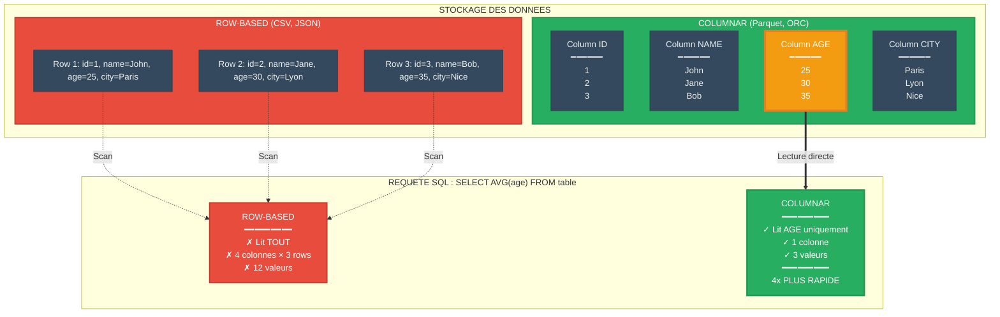
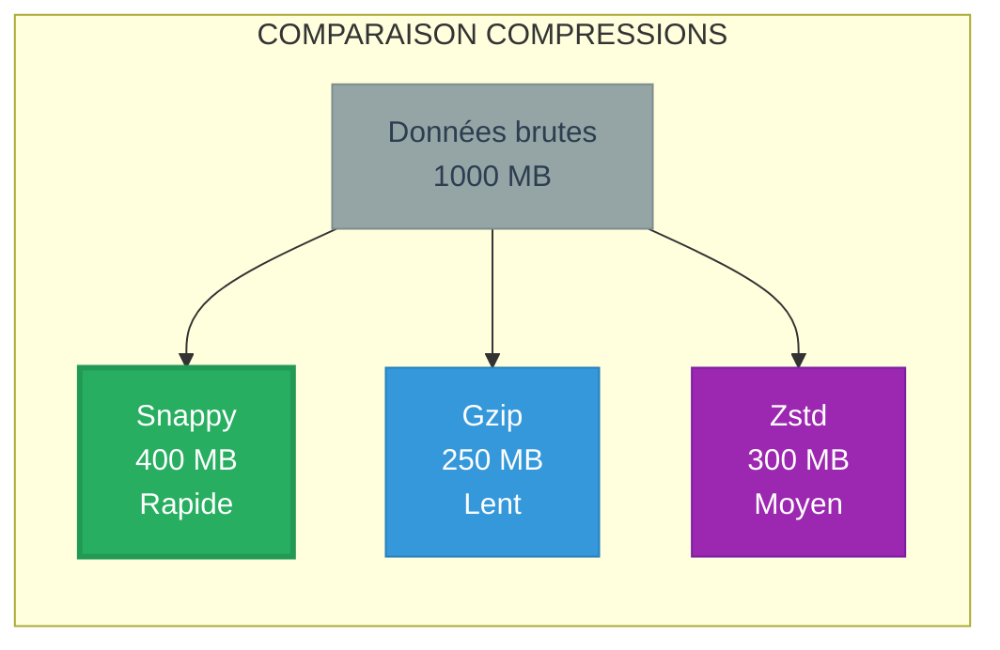
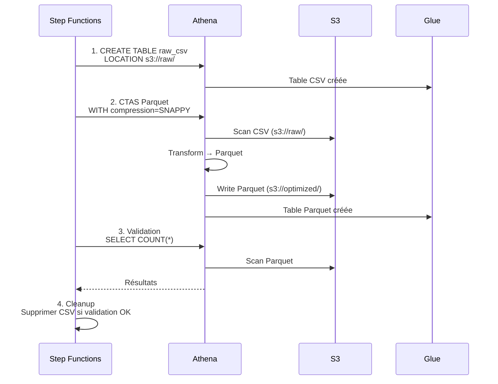

# MODULE 4 - OPTIMISATION PARQUET & PARTITIONNEMENT

**Durée** : 45 minutes  
**Niveau** : Avancé  
**Objectifs** : Maîtriser optimisations stockage et performances pour analytics Big Data

---

# 1. FORMATS DE DONNEES

## 1.1 Comparaison Formats



### Tableau Comparatif

| Format | Type | Compression | Lecture Colonne | Lecture Complète | Analytics | Usage |
|--------|------|-------------|-----------------|------------------|-----------|-------|
| **CSV** | Row-based | Faible | Scan tout | Rapide | Lent | Export, compatibilité |
| **JSON** | Row-based | Faible | Scan tout | Moyen | Lent | APIs, logs |
| **Parquet** | Columnar | **Excellente** | **Très rapide** | Moyen | **Optimal** | **Analytics, BI** |
| **ORC** | Columnar | Excellente | Très rapide | Moyen | Optimal | Hive, Spark |
| **Avro** | Row-based | Bonne | Scan tout | Rapide | Moyen | Streaming, schema evolution |

---

## 1.2 Pourquoi Parquet pour Analytics

**Requête typique analytics** :
```sql
SELECT AVG(fare_amount), SUM(trip_distance)
FROM taxi_data
WHERE year = '2020';
```

**Avec CSV** :
- Scan toutes colonnes (18 colonnes)
- Lecture séquentielle complète
- Pas de compression efficace

**Avec Parquet** :
- Scan uniquement colonnes `fare_amount`, `trip_distance`, `year`
- Lecture directe colonnes ciblées
- Compression par colonne optimale

**Résultat** : **10-100x plus rapide** selon requête

---

# 2. COMPRESSION

## 2.1 Algorithmes de Compression



| Algorithme | Ratio | Vitesse Comp. | Vitesse Décomp. | Cas d'usage |
|------------|-------|---------------|-----------------|-------------|
| **Snappy** | 2-3x | Très rapide | Très rapide | **Analytics interactives (Athena)** |
| **Gzip** | 3-5x | Lente | Moyenne | Archivage, transfert réseau |
| **Zstd** | 3-4x | Rapide | Rapide | Équilibre optimal |
| **LZ4** | 2x | Ultra rapide | Ultra rapide | Streaming, caching |

> **Recommandation Athena** : Snappy avec Parquet

---

## 2.2 Économies Réelles

**Exemple** : 10 TB données taxi NYC

| Métrique | Sans Compression | Snappy | Gzip |
|----------|------------------|--------|------|
| **Taille S3** | 10 TB | 4 TB | 2.5 TB |
| **Coût stockage/mois** | 230 USD | **92 USD** | 57.5 USD |
| **Scan Athena (100 req)** | 5000 USD | **2000 USD** | 1250 USD |
| **Latence query** | 30s | **10s** | 15s |

**Choix Snappy** : Meilleur compromis coût/performance pour requêtes fréquentes

---

# 3. PARTITIONNEMENT AVANCE

## 3.1 Stratégies de Partitionnement

### Partitionnement Temporel

```
s3://data/
├── year=2020/month=01/day=01/ (partition fine)
├── year=2020/month=01/day=02/
└── year=2020/month=02/day=01/
```

**Recommandations** :

| Volume Données/Jour | Granularité Partition | Exemple |
|---------------------|----------------------|---------|
| **< 1 GB** | Mensuelle | `year=2020/month=01/` |
| **1-10 GB** | Quotidienne | `year=2020/month=01/day=15/` |
| **10-100 GB** | Horaire | `year=2020/month=01/day=15/hour=14/` |
| **> 100 GB** | Sous-horaire | `year=2020/month=01/day=15/hour=14/minute=30/` |

---

### Partitionnement par Catégorie

```
s3://sales/
├── region=EMEA/country=FR/
├── region=EMEA/country=DE/
├── region=APAC/country=JP/
└── region=Americas/country=US/
```

**Usage** : Requêtes filtrées par dimensions métier

---

## 3.2 Taille Optimale des Partitions

**Règle générale** : **128 MB - 1 GB** par fichier Parquet

| Taille Fichier | Problème | Impact |
|----------------|----------|--------|
| **< 10 MB** | Trop de petits fichiers | Overhead métadonnées, latence |
| **10-128 MB** | Acceptable mais sous-optimal | Performance OK |
| **128 MB - 1 GB** | **OPTIMAL** | **Performance maximale** |
| **> 1 GB** | Fichiers trop gros | Latence lecture, moins de parallélisation |

**Solution pour petits fichiers** : Compaction

```sql
-- CTAS regroupe petits fichiers
CREATE TABLE taxi_compacted
WITH (format='PARQUET', external_location='s3://bucket/compacted/')
AS SELECT * FROM taxi_fragmented;
```

---

# 4. PIPELINE OPTIMISATION COMPLET

## 4.1 Workflow Conversion CSV → Parquet



---

## 4.2 Requête CTAS Complète

```sql
CREATE TABLE nyctaxidb.taxi_optimized
WITH (
  format = 'PARQUET',
  parquet_compression = 'SNAPPY',
  partitioned_by = ARRAY['pickup_year', 'pickup_month'],
  bucketed_by = ARRAY['pulocationid'],
  bucket_count = 10,
  external_location = 's3://mybucket/optimized/'
)
AS
SELECT 
  vendorid,
  CAST(tpep_pickup_datetime AS TIMESTAMP) AS pickup_datetime,
  CAST(tpep_dropoff_datetime AS TIMESTAMP) AS dropoff_datetime,
  CAST(passenger_count AS INT) AS passengers,
  CAST(trip_distance AS DECIMAL(10,2)) AS distance,
  CAST(fare_amount AS DECIMAL(10,2)) AS fare,
  CAST(total_amount AS DECIMAL(10,2)) AS total,
  pulocationid,
  dolocationid,
  YEAR(tpep_pickup_datetime) AS pickup_year,
  MONTH(tpep_pickup_datetime) AS pickup_month
FROM nyctaxidb.taxi_raw
WHERE YEAR(tpep_pickup_datetime) >= 2020;
```

**Optimisations appliquées** :
- Format columnar (Parquet)
- Compression rapide (Snappy)
- Partitionnement (year/month)
- Bucketing (location) pour joins
- Cast types précis (DECIMAL vs DOUBLE)

---

# 5. BENCHMARKS REELS

## 5.1 Performance Athena

**Dataset** : 1 année données taxis NYC (100 GB)

| Format | Taille | Query 1 (scan complet) | Query 2 (1 mois) | Coût Query 2 |
|--------|--------|------------------------|------------------|--------------|
| **CSV** | 100 GB | 45 sec | 15 sec | 0.075 USD |
| **Parquet** | 30 GB | 12 sec | 2.5 sec | 0.0125 USD |
| **Parquet + Partition** | 30 GB | 12 sec | **0.8 sec** | **0.004 USD** |

**Gains cumulés** :
- Taille : -70%
- Performance : -95%
- Coût : -95%

---

## 5.2 Calcul ROI Optimisation

**Scénario** :
- 500 TB données/an
- 10K requêtes/mois
- Moyenne 100 GB scanné/requête

**Coûts AVANT optimisation (CSV)** :
- Stockage : 500 TB × 0.023 = 11,500 USD/mois
- Requêtes : 10K × 100 GB × 5 USD/TB = 50,000 USD/mois
- **Total : 61,500 USD/mois**

**Coûts APRES optimisation (Parquet + Partitions)** :
- Stockage : 150 TB × 0.023 = 3,450 USD/mois (-70%)
- Requêtes : 10K × 10 GB × 5 USD/TB = 5,000 USD/mois (-90%)
- **Total : 8,450 USD/mois**

**Économie : 53,050 USD/mois** (86% réduction)

---

# 6. POINTS CLES DU MODULE

- Parquet = format columnar optimal pour analytics
- Compression Snappy = meilleur compromis vitesse/ratio
- Partitionnement réduit 90-99% données scannées
- Taille optimale fichier : 128 MB - 1 GB
- CTAS convertit formats en une requête
- ROI optimisation est massif (70-90% économies)
- Naming conventions et organisation critiques
- Monitoring Athena via CloudWatch essentiel

---

# 7. EXERCICES

1. Concevez stratégie de partitionnement pour :
   - Logs applicatifs (50 GB/jour)
   - Rétention 1 an
   - Requêtes fréquentes sur derniers 7 jours

2. Calculez économies annuelles :
   - Conversion 1 PB CSV en Parquet (-70%)
   - 100K requêtes/mois sur partitions (-90% scan)

3. Créez requête CTAS avec :
   - CSV → Parquet
   - Compression Snappy
   - Partitions : year, month, day
   - Bucket par user_id (10 buckets)

4. Comparez formats pour streaming vs batch :
   - JSON/Avro pour Kinesis
   - Parquet pour S3/Athena

5. Workflow Step Functions pipeline d'optimisation quotidien :
   - Extract nouvelles données CSV
   - Transform → Parquet partitionné
   - Load dans Glue
   - Cleanup anciens CSV

