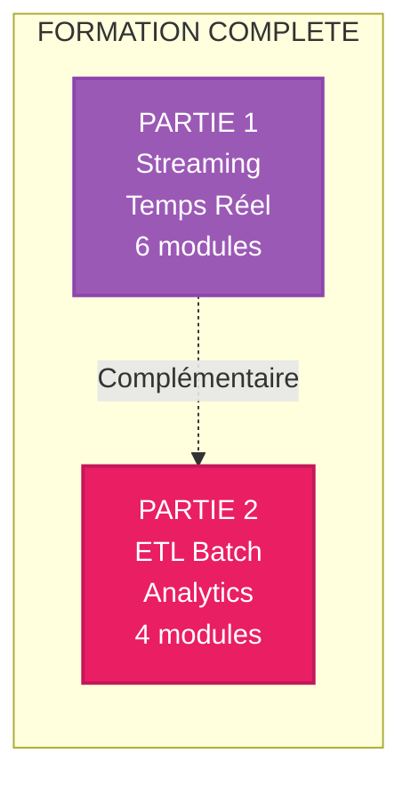

# FORMATION PROFESSIONNELLE - PARTIE 2
## PIPELINES ETL BATCH AVEC AWS

> Formation condensée sur l'orchestration de pipelines ETL batch avec Step Functions, Glue et Athena

---

## PRESENTATION

Cette formation **PARTIE 2** complète la **PARTIE 1 (Streaming temps réel)** en couvrant les **pipelines ETL batch** pour analytics sur données historiques.

### Différence PARTIE 1 vs PARTIE 2

```mermaid
graph TB
    subgraph P1["PARTIE 1 - STREAMING TEMPS REEL"]
        S1[Kinesis<br/>Ingestion continue]
        S2[Lambda<br/>Transformation live]
        S3[OpenSearch<br/>Indexation temps réel]
        S1 --> S2 --> S3
    end
    
    subgraph P2["PARTIE 2 - ETL BATCH"]
        B1[S3<br/>Données au repos]
        B2[Step Functions<br/>Orchestration workflow]
        B3[Glue + Athena<br/>Transformation batch]
        B4[Parquet optimisé<br/>Analytics SQL]
        B1 --> B2 --> B3 --> B4
    end
    
    style S1 fill:#9b59b6,stroke:#8e44ad,color:#fff
    style S2 fill:#e67e22,stroke:#d35400,color:#fff
    style S3 fill:#3498db,stroke:#2980b9,color:#fff
    style B1 fill:#27ae60,stroke:#229954,color:#fff
    style B2 fill:#e91e63,stroke:#c2185b,color:#fff
    style B3 fill:#9c27b0,stroke:#7b1fa2,color:#fff
    style B4 fill:#ff9800,stroke:#f57c00,color:#fff
```



| Critère | PARTIE 1 - Streaming | PARTIE 2 - ETL Batch |
|---------|---------------------|----------------------|
| **Latence** | < 1 seconde | Minutes à heures |
| **Traitement** | Continu temps réel | Périodique par lots |
| **Services** | Kinesis, Lambda, OpenSearch | Step Functions, Glue, Athena |
| **Format** | JSON streaming | Parquet/CSV optimisé |
| **Cas d'usage** | Monitoring, alertes, fraude | Rapports, analytics historique, BI |

---

## STRUCTURE

```
FORMATION-PROFESSIONNELLE-PARTIE-2/
├── README.md
├── 00-INDEX-FORMATION.md
├── 00-GUIDE-UTILISATION.md
│
├── 01-COURS/ (4 modules - 3h30)
│   ├── MODULE-01-ETL-Batch-vs-Streaming.md (45 min)
│   ├── MODULE-02-AWS-Step-Functions.md (60 min)
│   ├── MODULE-03-AWS-Glue-Athena.md (60 min)
│   └── MODULE-04-Optimisation-Parquet.md (45 min)
│
├── 02-EVALUATIONS/
│   ├── QCM/ (40 questions)
│   └── QUESTIONS-DEVELOPPEMENT/ (8 questions)
│
└── 03-RESSOURCES/
    └── GLOSSAIRE-ETL.md
```

---

## MODULES DE COURS

| Module | Titre | Durée | Niveau | Contenu |
|--------|-------|-------|--------|---------|
| **01** | ETL Batch vs Streaming | 45 min | Fondamental | Différences, cas d'usage, choix |
| **02** | AWS Step Functions | 60 min | Intermédiaire | Workflows, orchestration, états |
| **03** | AWS Glue & Athena | 60 min | Intermédiaire | Catalogue, tables, requêtes SQL |
| **04** | Optimisation Parquet | 45 min | Avancé | Formats, compression, partitionnement |

**Durée totale** : 3 heures 30 minutes

---

## OBJECTIFS D'APPRENTISSAGE

À l'issue de cette formation PARTIE 2, vous serez capable de :

- Différencier ETL batch et streaming temps réel
- Orchestrer des workflows avec AWS Step Functions
- Créer catalogues de données avec AWS Glue
- Requêter données S3 avec Amazon Athena (SQL)
- Optimiser stockage avec format Parquet et compression Snappy
- Partitionner données pour performances optimales
- Choisir entre approche batch et streaming selon le cas d'usage

---

## PRE-REQUIS

### Connaissances Requises

- **PARTIE 1 complétée** (recommandé mais non obligatoire)
- AWS de base (S3, IAM)
- SQL (SELECT, JOIN, CREATE TABLE)
- Concepts ETL (Extract, Transform, Load)

### Connaissances Recommandées

- Formats de données (CSV, JSON, Parquet)
- Compression de données
- Optimisation requêtes SQL

---

## EVALUATION

### Système de Notation

| Composante | Poids | Détails |
|------------|-------|---------|
| QCM | 30% | 40 questions |
| Questions Développement | 60% | 8 questions avec schémas |
| Participation | 10% | Engagement |

**Note minimale** : 12/20

---

## PARCOURS PEDAGOGIQUE

### Semaine 1 : Fondamentaux ETL

- **Jour 1** : MODULE 01 - ETL Batch vs Streaming
- **Jour 2** : MODULE 02 - Step Functions
- **Jour 3** : QCM Modules 01-02
- **Jour 4-5** : Questions développement 1-4

### Semaine 2 : Optimisation et Pratique

- **Jour 1** : MODULE 03 - Glue & Athena
- **Jour 2** : MODULE 04 - Optimisation Parquet
- **Jour 3** : QCM Modules 03-04
- **Jour 4-5** : Questions développement 5-8

---

## COMPARAISON PARTIE 1 vs PARTIE 2



**Ensemble** : Formation complète ingénierie des données AWS (streaming + batch)

---

## RESSOURCES COMPLEMENTAIRES

### Documentation AWS

- [AWS Step Functions Developer Guide](https://docs.aws.amazon.com/step-functions/)
- [AWS Glue Developer Guide](https://docs.aws.amazon.com/glue/)
- [Amazon Athena User Guide](https://docs.aws.amazon.com/athena/)
- [Apache Parquet Documentation](https://parquet.apache.org/)

### Certifications

**AWS Certified Data Analytics - Specialty** :
- PARTIE 1 : Collection, Processing (streaming)
- PARTIE 2 : Storage, Analysis (batch)


